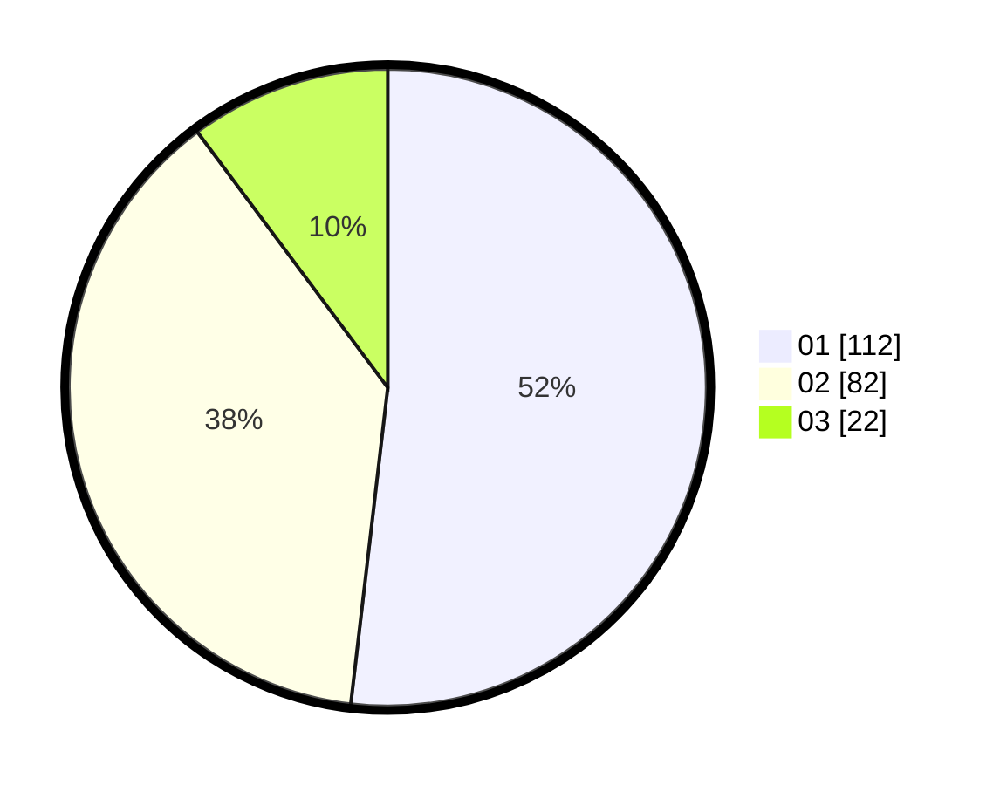

# Hasil

Hasil perolehan suara paslon dapat dilihat pada file paslon-01.txt, paslon-02.txt, dan paslon-03.txt.

Jika tidak ada, artinya data tersebut belum ada pada SIREKAP.

## Perolehan Suara

 * Paslon 01: **112**.
 * Paslon 02: **82**.
 * Paslon 03: **22**.

## Foto C Plano

https://sirekap-obj-formc.kpu.go.id/410a/pemilu/ppwp/31/73/05/10/03/3173051003093-20240216-175911--0b312540-34d1-411c-94d0-01f2fdb481ac.jpg

https://sirekap-obj-formc.kpu.go.id/410a/pemilu/ppwp/31/73/05/10/03/3173051003093-20240216-013037--3b2090f1-4f9e-4486-9cf7-14ec6c900b9d.jpg

https://sirekap-obj-formc.kpu.go.id/410a/pemilu/ppwp/31/73/05/10/03/3173051003093-20240216-013030--09a0d67b-4895-43e8-ba35-610a908f5987.jpg

## DATA PEMILIH TETAP

Jumlah pemilih dalam DPT: **279**.
 * L: **132**.
 * P: **147**.

## DATA PENGGUNA HAK PILIH

Jumlah pengguna hak pilih dalam DPT: **215**.
 * L: **93**.
 * P: **122**.

Jumlah pengguna hak pilih dalam DPTb: **0**.
 * L: **0**.
 * P: **0**.

Jumlah pengguna hak pilih dalam DPK: **2**.
 * L: **1**.
 * P: **1**.

Jumlah pengguna hak pilih: **217**.
 * L: **94**.
 * P: **123**.

## JUMLAH SUARA SAH DAN TIDAK SAH

JUMLAH SELURUH SUARA SAH: **216**.

JUMLAH SUARA TIDAK SAH: **1**.

JUMLAH SELURUH SUARA SAH DAN SUARA TIDAK SAH: **217**.
