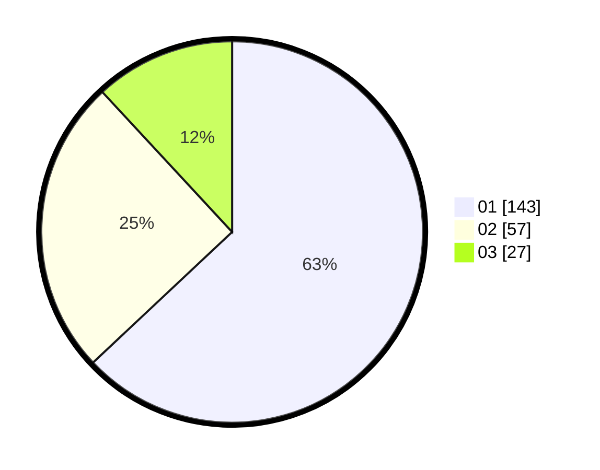

# Hasil

Hasil perolehan suara paslon dapat dilihat pada file paslon-01.txt, paslon-02.txt, dan paslon-03.txt.

Jika tidak ada, artinya data tersebut belum ada pada SIREKAP.

## Perolehan Suara

 * Paslon 01: **143**.
 * Paslon 02: **57**.
 * Paslon 03: **27**.

## Foto C Plano

https://sirekap-obj-formc.kpu.go.id/b058/pemilu/ppwp/31/73/05/10/03/3173051003094-20240216-135632--231f4cb0-2f96-4e77-8ae7-dc6acf980030.jpg

https://sirekap-obj-formc.kpu.go.id/b058/pemilu/ppwp/31/73/05/10/03/3173051003094-20240216-135633--f98c5b7a-8f7a-4bf7-9010-402d89d4a10f.jpg

https://sirekap-obj-formc.kpu.go.id/b058/pemilu/ppwp/31/73/05/10/03/3173051003094-20240216-135633--7aac5118-1aaf-4ddd-87a6-f928dcd71136.jpg

## DATA PEMILIH TETAP

Jumlah pemilih dalam DPT: **278**.
 * L: **146**.
 * P: **132**.

## DATA PENGGUNA HAK PILIH

Jumlah pengguna hak pilih dalam DPT: **227**.
 * L: **120**.
 * P: **107**.

Jumlah pengguna hak pilih dalam DPTb: **2**.
 * L: **1**.
 * P: **1**.

Jumlah pengguna hak pilih dalam DPK: **0**.
 * L: **0**.
 * P: **0**.

Jumlah pengguna hak pilih: **229**.
 * L: **121**.
 * P: **108**.

## JUMLAH SUARA SAH DAN TIDAK SAH

JUMLAH SELURUH SUARA SAH: **227**.

JUMLAH SUARA TIDAK SAH: **2**.

JUMLAH SELURUH SUARA SAH DAN SUARA TIDAK SAH: **229**.
