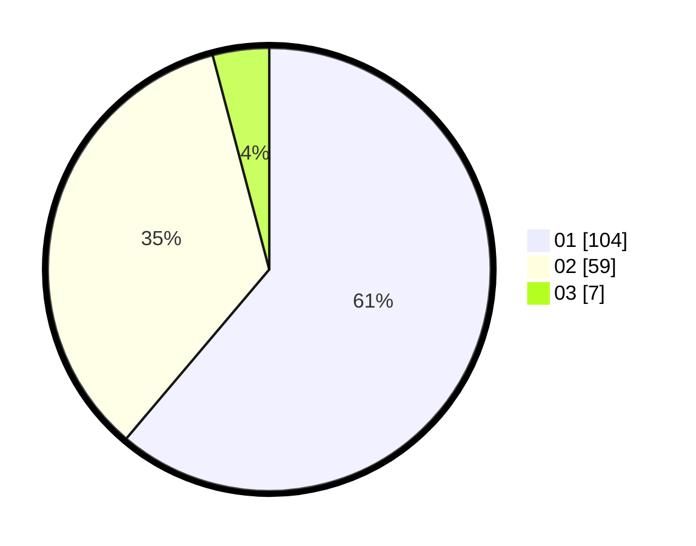

# Hasil

Hasil perolehan suara paslon dapat dilihat pada file paslon-01.txt, paslon-02.txt, dan paslon-03.txt.

Jika tidak ada, artinya data tersebut belum ada pada SIREKAP.

## Perolehan Suara

 * Paslon 01: **104**.
 * Paslon 02: **59**.
 * Paslon 03: **7**.

## Foto C Plano

https://sirekap-obj-formc.kpu.go.id/4d30/pemilu/ppwp/31/73/05/10/03/3173051003095-20240214-194622--223cd93f-9b03-49d0-9f5f-1d033b64b590.jpg

https://sirekap-obj-formc.kpu.go.id/4d30/pemilu/ppwp/31/73/05/10/03/3173051003095-20240214-194900--2b673402-9ea2-42d2-b681-768b81eb982d.jpg

https://sirekap-obj-formc.kpu.go.id/4d30/pemilu/ppwp/31/73/05/10/03/3173051003095-20240214-195013--4860ff2c-ef0f-4d0c-82e2-1565220e9d80.jpg

## DATA PEMILIH TETAP

Jumlah pemilih dalam DPT: **240**.
 * L: **108**.
 * P: **132**.

## DATA PENGGUNA HAK PILIH

Jumlah pengguna hak pilih dalam DPT: **171**.
 * L: **73**.
 * P: **98**.

Jumlah pengguna hak pilih dalam DPTb: **0**.
 * L: **0**.
 * P: **0**.

Jumlah pengguna hak pilih dalam DPK: **3**.
 * L: **1**.
 * P: **2**.

Jumlah pengguna hak pilih: **174**.
 * L: **74**.
 * P: **100**.

## JUMLAH SUARA SAH DAN TIDAK SAH

JUMLAH SELURUH SUARA SAH: **170**.

JUMLAH SUARA TIDAK SAH: **4**.

JUMLAH SELURUH SUARA SAH DAN SUARA TIDAK SAH: **174**.
