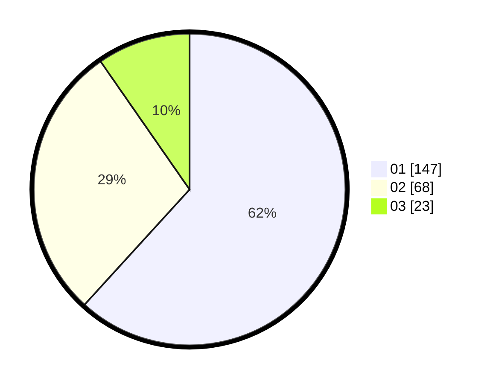

# Hasil

Hasil perolehan suara paslon dapat dilihat pada file paslon-01.txt, paslon-02.txt, dan paslon-03.txt.

Jika tidak ada, artinya data tersebut belum ada pada SIREKAP.

## Perolehan Suara

 * Paslon 01: **147**.
 * Paslon 02: **68**.
 * Paslon 03: **23**.

## Foto C Plano

https://sirekap-obj-formc.kpu.go.id/befb/pemilu/ppwp/31/73/05/10/03/3173051003096-20240216-015933--6c61e79a-7126-40ea-97c3-d0d50e78d74f.jpg

https://sirekap-obj-formc.kpu.go.id/befb/pemilu/ppwp/31/73/05/10/03/3173051003096-20240216-015942--14d1668c-b484-46db-9bab-f81049fe93e6.jpg

https://sirekap-obj-formc.kpu.go.id/befb/pemilu/ppwp/31/73/05/10/03/3173051003096-20240216-015935--ee9f7c95-6654-465d-9a01-1597ceb63ca2.jpg

## DATA PEMILIH TETAP

Jumlah pemilih dalam DPT: **286**.
 * L: **151**.
 * P: **135**.

## DATA PENGGUNA HAK PILIH

Jumlah pengguna hak pilih dalam DPT: **232**.
 * L: **124**.
 * P: **108**.

Jumlah pengguna hak pilih dalam DPTb: **4**.
 * L: **1**.
 * P: **3**.

Jumlah pengguna hak pilih dalam DPK: **4**.
 * L: **2**.
 * P: **2**.

Jumlah pengguna hak pilih: **240**.
 * L: **127**.
 * P: **113**.

## JUMLAH SUARA SAH DAN TIDAK SAH

JUMLAH SELURUH SUARA SAH: **238**.

JUMLAH SUARA TIDAK SAH: **2**.

JUMLAH SELURUH SUARA SAH DAN SUARA TIDAK SAH: **240**.
