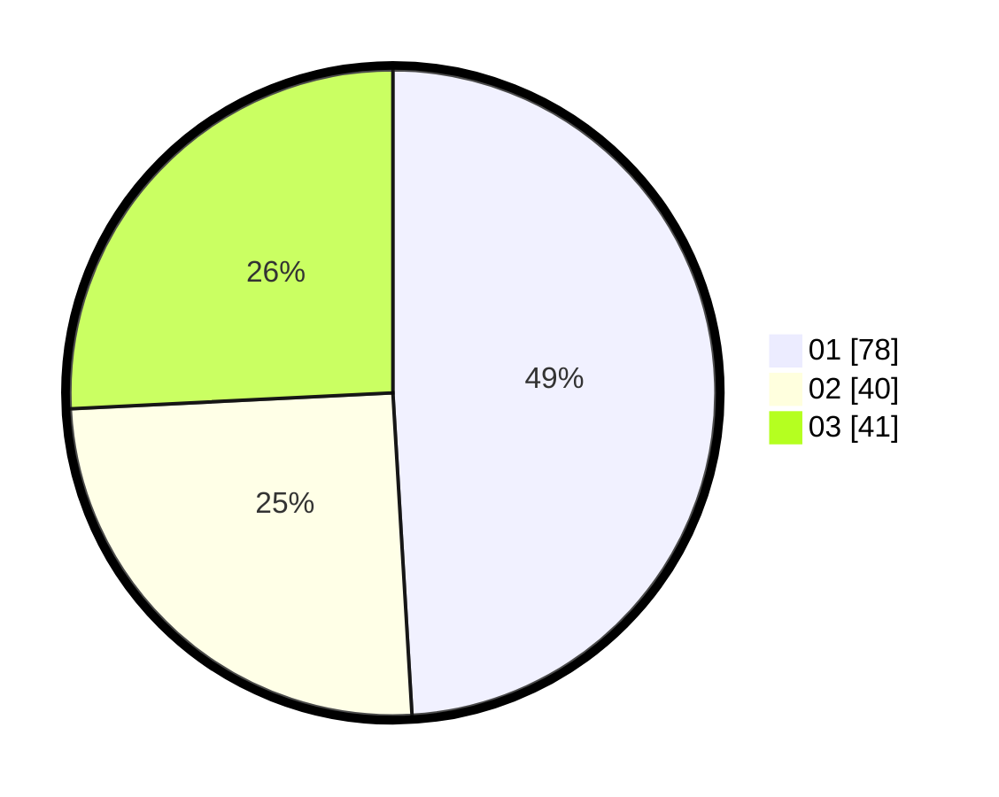

# Hasil

Hasil perolehan suara paslon dapat dilihat pada file paslon-01.txt, paslon-02.txt, dan paslon-03.txt.

Jika tidak ada, artinya data tersebut belum ada pada SIREKAP.

## Perolehan Suara

 * Paslon 01: **78**.
 * Paslon 02: **40**.
 * Paslon 03: **41**.

## Foto C Plano

https://sirekap-obj-formc.kpu.go.id/0b3a/pemilu/ppwp/31/73/05/10/03/3173051003099-20240215-000540--3554d074-7d1c-4498-9800-f0710ce7bf3d.jpg

https://sirekap-obj-formc.kpu.go.id/0b3a/pemilu/ppwp/31/73/05/10/03/3173051003099-20240214-235904--110dc7c4-255a-4eb4-ac39-1d52bc720640.jpg

https://sirekap-obj-formc.kpu.go.id/0b3a/pemilu/ppwp/31/73/05/10/03/3173051003099-20240215-000045--bc359ecb-4a9f-4fe4-9a5b-a1a1a0de0907.jpg
