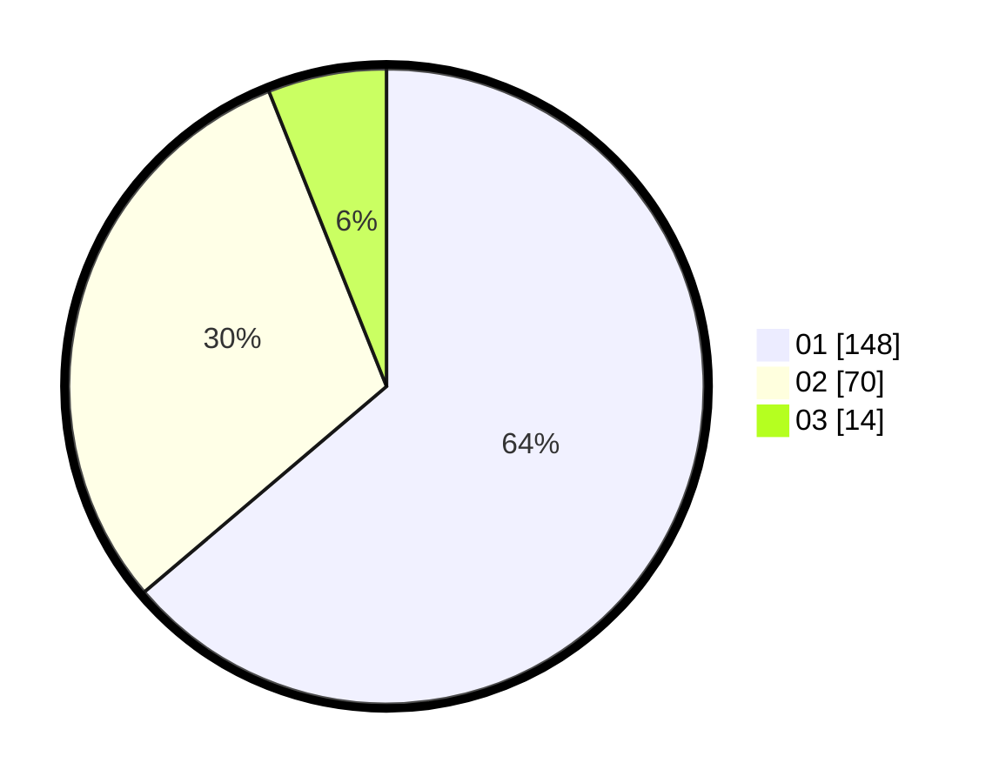

# Hasil

Hasil perolehan suara paslon dapat dilihat pada file paslon-01.txt, paslon-02.txt, dan paslon-03.txt.

Jika tidak ada, artinya data tersebut belum ada pada SIREKAP.

## Perolehan Suara

 * Paslon 01: **148**.
 * Paslon 02: **70**.
 * Paslon 03: **14**.

## Foto C Plano

https://sirekap-obj-formc.kpu.go.id/dd20/pemilu/ppwp/31/73/05/10/03/3173051003100-20240214-234516--cd25ca71-68f5-467a-ad11-bc75ff935bd6.jpg

https://sirekap-obj-formc.kpu.go.id/dd20/pemilu/ppwp/31/73/05/10/03/3173051003100-20240214-234702--fcc635ee-1163-4cfd-979e-437a2731de7c.jpg
