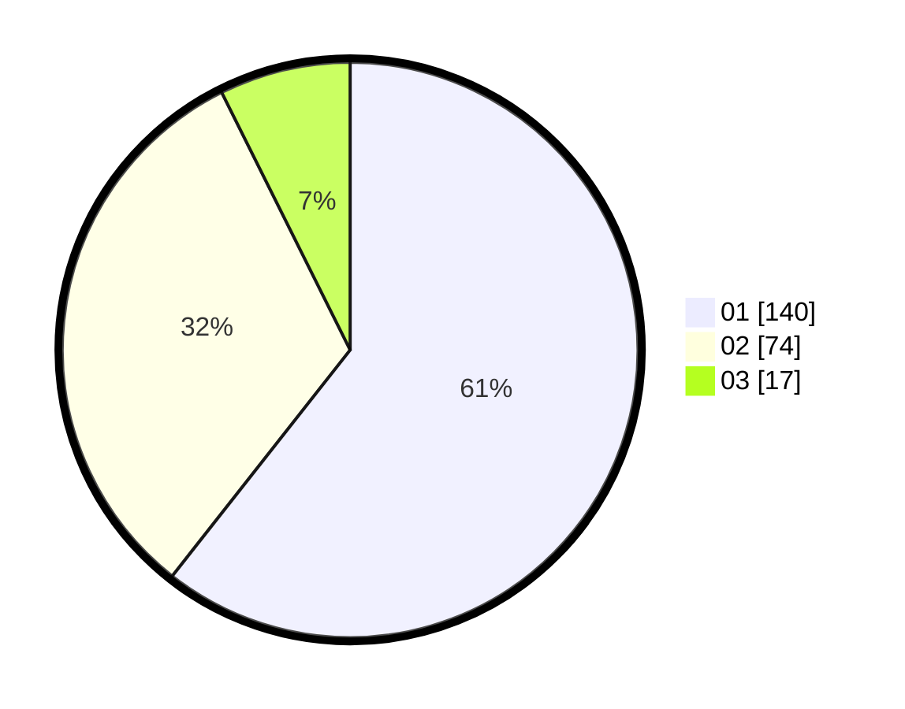

# Hasil

Hasil perolehan suara paslon dapat dilihat pada file paslon-01.txt, paslon-02.txt, dan paslon-03.txt.

Jika tidak ada, artinya data tersebut belum ada pada SIREKAP.

## Perolehan Suara

 * Paslon 01: **140**.
 * Paslon 02: **74**.
 * Paslon 03: **17**.

## Foto C Plano

https://sirekap-obj-formc.kpu.go.id/0f37/pemilu/ppwp/31/73/05/10/03/3173051003101-20240214-212603--f827d16d-5c1a-49e0-85eb-43165adee067.jpg

https://sirekap-obj-formc.kpu.go.id/0f37/pemilu/ppwp/31/73/05/10/03/3173051003101-20240214-212718--a9461a9f-abaf-49dc-923d-18c9218f0df0.jpg

https://sirekap-obj-formc.kpu.go.id/0f37/pemilu/ppwp/31/73/05/10/03/3173051003101-20240214-212855--ee5dc0be-307b-4949-add9-f2e9898bcf42.jpg

## DATA PEMILIH TETAP

Jumlah pemilih dalam DPT: **287**.
 * L: **146**.
 * P: **141**.

## DATA PENGGUNA HAK PILIH

Jumlah pengguna hak pilih dalam DPT: **228**.
 * L: **111**.
 * P: **117**.

Jumlah pengguna hak pilih dalam DPTb: **0**.
 * L: **0**.
 * P: **0**.

Jumlah pengguna hak pilih dalam DPK: **6**.
 * L: **2**.
 * P: **4**.

Jumlah pengguna hak pilih: **234**.
 * L: **113**.
 * P: **121**.

## JUMLAH SUARA SAH DAN TIDAK SAH

JUMLAH SELURUH SUARA SAH: **231**.

JUMLAH SUARA TIDAK SAH: **3**.

JUMLAH SELURUH SUARA SAH DAN SUARA TIDAK SAH: **234**.
