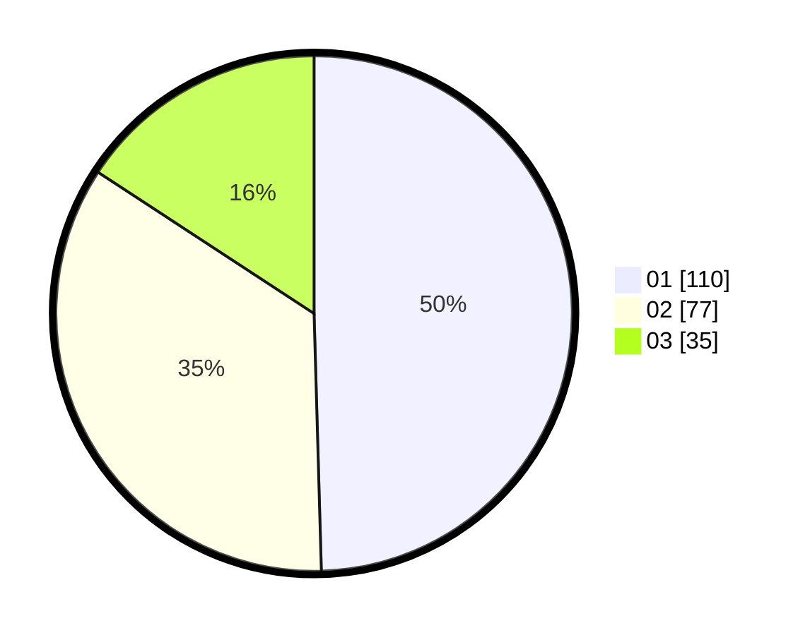

# Hasil

Hasil perolehan suara paslon dapat dilihat pada file paslon-01.txt, paslon-02.txt, dan paslon-03.txt.

Jika tidak ada, artinya data tersebut belum ada pada SIREKAP.

## Perolehan Suara

 * Paslon 01: **110**.
 * Paslon 02: **77**.
 * Paslon 03: **35**.

## Foto C Plano

https://sirekap-obj-formc.kpu.go.id/d25c/pemilu/ppwp/31/73/05/10/03/3173051003102-20240214-204013--3cf7a334-f88e-463c-a912-31187b224f54.jpg

https://sirekap-obj-formc.kpu.go.id/d25c/pemilu/ppwp/31/73/05/10/03/3173051003102-20240214-204036--f42fa294-9494-47d2-9a5b-dbdeac253573.jpg

https://sirekap-obj-formc.kpu.go.id/d25c/pemilu/ppwp/31/73/05/10/03/3173051003102-20240214-204055--2d157655-4fe8-42c4-865d-954f6111938b.jpg

## DATA PEMILIH TETAP

Jumlah pemilih dalam DPT: **279**.
 * L: **141**.
 * P: **138**.

## DATA PENGGUNA HAK PILIH

Jumlah pengguna hak pilih dalam DPT: **223**.
 * L: **109**.
 * P: **114**.

Jumlah pengguna hak pilih dalam DPTb: **0**.
 * L: **0**.
 * P: **0**.

Jumlah pengguna hak pilih dalam DPK: **2**.
 * L: **0**.
 * P: **2**.

Jumlah pengguna hak pilih: **225**.
 * L: **109**.
 * P: **116**.

## JUMLAH SUARA SAH DAN TIDAK SAH

JUMLAH SELURUH SUARA SAH: **222**.

JUMLAH SUARA TIDAK SAH: **3**.

JUMLAH SELURUH SUARA SAH DAN SUARA TIDAK SAH: **225**.
