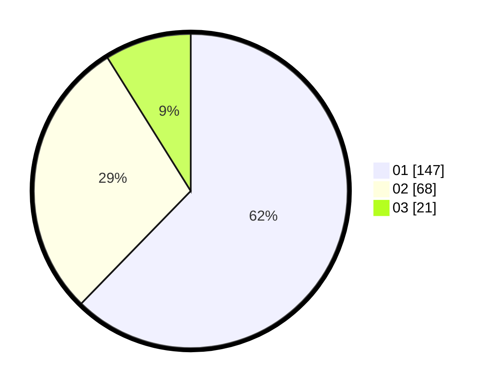

# Hasil

Hasil perolehan suara paslon dapat dilihat pada file paslon-01.txt, paslon-02.txt, dan paslon-03.txt.

Jika tidak ada, artinya data tersebut belum ada pada SIREKAP.

## Perolehan Suara

 * Paslon 01: **147**.
 * Paslon 02: **68**.
 * Paslon 03: **21**.

## Foto C Plano

https://sirekap-obj-formc.kpu.go.id/8ae8/pemilu/ppwp/31/73/05/10/03/3173051003105-20240214-215157--083b933c-38d9-4f3f-bdda-8836daa1f0a4.jpg

https://sirekap-obj-formc.kpu.go.id/8ae8/pemilu/ppwp/31/73/05/10/03/3173051003105-20240214-215313--96f21499-c29e-4fb7-8d81-0ee9d0ae4381.jpg

https://sirekap-obj-formc.kpu.go.id/8ae8/pemilu/ppwp/31/73/05/10/03/3173051003105-20240214-215443--0ae464d5-9b53-4f5d-adec-a934103d48f0.jpg
