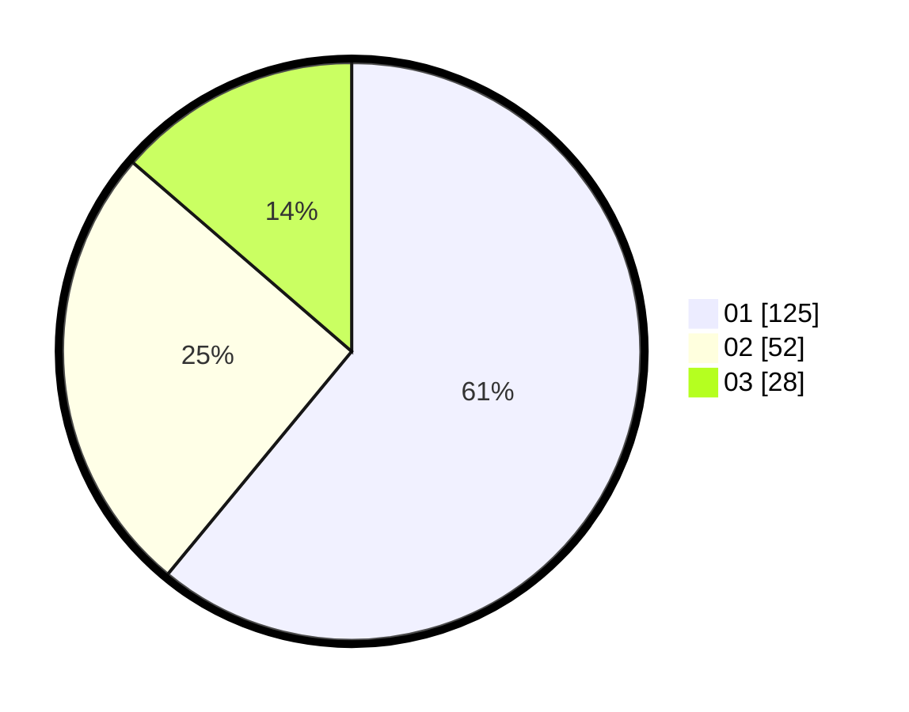

# Hasil

Hasil perolehan suara paslon dapat dilihat pada file paslon-01.txt, paslon-02.txt, dan paslon-03.txt.

Jika tidak ada, artinya data tersebut belum ada pada SIREKAP.

## Perolehan Suara

 * Paslon 01: **125**.
 * Paslon 02: **52**.
 * Paslon 03: **28**.

## Foto C Plano

https://sirekap-obj-formc.kpu.go.id/0146/pemilu/ppwp/31/73/05/10/03/3173051003106-20240216-213741--0e73ca1b-94ac-4efb-ace5-2d00e75f4504.jpg

https://sirekap-obj-formc.kpu.go.id/0146/pemilu/ppwp/31/73/05/10/03/3173051003106-20240216-220551--1bd1da77-f92a-4cc8-a264-1fcd8a6c36bb.jpg

https://sirekap-obj-formc.kpu.go.id/0146/pemilu/ppwp/31/73/05/10/03/3173051003106-20240216-215533--c492c03a-7691-42fe-b309-7c2e673915bb.jpg

## DATA PEMILIH TETAP

Jumlah pemilih dalam DPT: **257**.
 * L: **141**.
 * P: **116**.

## DATA PENGGUNA HAK PILIH

Jumlah pengguna hak pilih dalam DPT: **194**.
 * L: **106**.
 * P: **88**.

Jumlah pengguna hak pilih dalam DPTb: **2**.
 * L: **1**.
 * P: **1**.

Jumlah pengguna hak pilih dalam DPK: **9**.
 * L: **6**.
 * P: **3**.

Jumlah pengguna hak pilih: **205**.
 * L: **113**.
 * P: **92**.

## JUMLAH SUARA SAH DAN TIDAK SAH

JUMLAH SELURUH SUARA SAH: **205**.

JUMLAH SUARA TIDAK SAH: **0**.

JUMLAH SELURUH SUARA SAH DAN SUARA TIDAK SAH: **205**.
