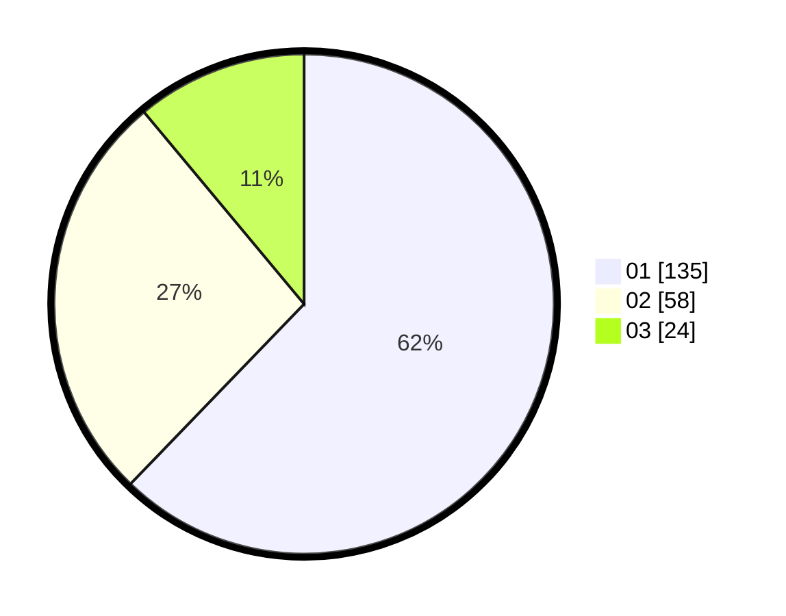

# Hasil

Hasil perolehan suara paslon dapat dilihat pada file paslon-01.txt, paslon-02.txt, dan paslon-03.txt.

Jika tidak ada, artinya data tersebut belum ada pada SIREKAP.

## Perolehan Suara

 * Paslon 01: **135**.
 * Paslon 02: **58**.
 * Paslon 03: **24**.

## Foto C Plano

https://sirekap-obj-formc.kpu.go.id/e558/pemilu/ppwp/31/73/05/10/03/3173051003110-20240214-155323--72f62da4-bc42-4f49-868d-b96d38dcc0e2.jpg

https://sirekap-obj-formc.kpu.go.id/e558/pemilu/ppwp/31/73/05/10/03/3173051003110-20240214-155144--a28f64ce-021c-4014-8da6-426e7763f941.jpg

https://sirekap-obj-formc.kpu.go.id/e558/pemilu/ppwp/31/73/05/10/03/3173051003110-20240214-160114--3dbee347-3227-44fb-90fc-f08d47a67f97.jpg

## DATA PEMILIH TETAP

Jumlah pemilih dalam DPT: **279**.
 * L: **143**.
 * P: **136**.

## DATA PENGGUNA HAK PILIH

Jumlah pengguna hak pilih dalam DPT: **222**.
 * L: **106**.
 * P: **116**.

Jumlah pengguna hak pilih dalam DPTb: **0**.
 * L: **0**.
 * P: **0**.

Jumlah pengguna hak pilih dalam DPK: **0**.
 * L: **0**.
 * P: **0**.

Jumlah pengguna hak pilih: **222**.
 * L: **106**.
 * P: **116**.

## JUMLAH SUARA SAH DAN TIDAK SAH

JUMLAH SELURUH SUARA SAH: **217**.

JUMLAH SUARA TIDAK SAH: **5**.

JUMLAH SELURUH SUARA SAH DAN SUARA TIDAK SAH: **222**.
