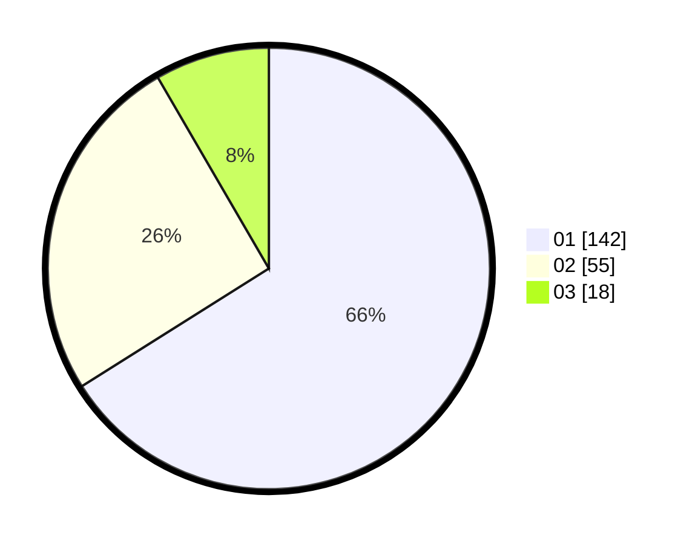

# Hasil

Hasil perolehan suara paslon dapat dilihat pada file paslon-01.txt, paslon-02.txt, dan paslon-03.txt.

Jika tidak ada, artinya data tersebut belum ada pada SIREKAP.

## Perolehan Suara

 * Paslon 01: **142**.
 * Paslon 02: **55**.
 * Paslon 03: **18**.

## Foto C Plano

https://sirekap-obj-formc.kpu.go.id/0a80/pemilu/ppwp/31/73/05/10/03/3173051003111-20240215-003611--9d08a464-0342-4df2-b414-2e39b4d59c0e.jpg

https://sirekap-obj-formc.kpu.go.id/0a80/pemilu/ppwp/31/73/05/10/03/3173051003111-20240215-003758--65ff60af-ae9c-456d-872a-f63bf45f4f46.jpg

https://sirekap-obj-formc.kpu.go.id/0a80/pemilu/ppwp/31/73/05/10/03/3173051003111-20240215-004029--aa84fdb8-688f-4549-82cf-a3ec41b826a7.jpg

## DATA PEMILIH TETAP

Jumlah pemilih dalam DPT: **276**.
 * L: **145**.
 * P: **131**.

## DATA PENGGUNA HAK PILIH

Jumlah pengguna hak pilih dalam DPT: **218**.
 * L: **111**.
 * P: **107**.

Jumlah pengguna hak pilih dalam DPTb: **0**.
 * L: **0**.
 * P: **0**.

Jumlah pengguna hak pilih dalam DPK: **0**.
 * L: **0**.
 * P: **0**.

Jumlah pengguna hak pilih: **218**.
 * L: **111**.
 * P: **107**.

## JUMLAH SUARA SAH DAN TIDAK SAH

JUMLAH SELURUH SUARA SAH: **215**.

JUMLAH SUARA TIDAK SAH: **3**.

JUMLAH SELURUH SUARA SAH DAN SUARA TIDAK SAH: **218**.
