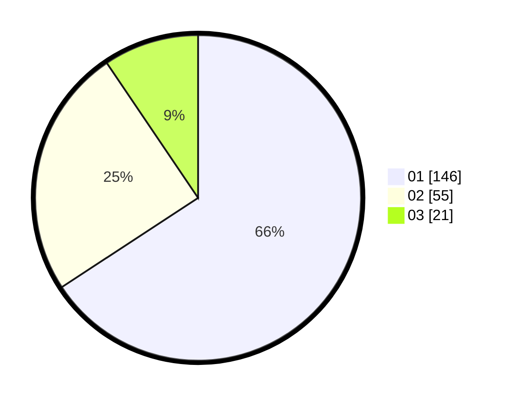

# Hasil

Hasil perolehan suara paslon dapat dilihat pada file paslon-01.txt, paslon-02.txt, dan paslon-03.txt.

Jika tidak ada, artinya data tersebut belum ada pada SIREKAP.

## Perolehan Suara

 * Paslon 01: **146**.
 * Paslon 02: **55**.
 * Paslon 03: **21**.

## Foto C Plano

https://sirekap-obj-formc.kpu.go.id/3fac/pemilu/ppwp/31/73/05/10/03/3173051003112-20240215-010701--60e3d2c0-ee62-4060-a373-42abb3165784.jpg

https://sirekap-obj-formc.kpu.go.id/3fac/pemilu/ppwp/31/73/05/10/03/3173051003112-20240215-010808--e02382f6-63f9-487b-a408-4f28fba4d738.jpg

https://sirekap-obj-formc.kpu.go.id/3fac/pemilu/ppwp/31/73/05/10/03/3173051003112-20240215-010855--833b39b8-5f33-4bf9-b54a-ff6957379eb2.jpg
