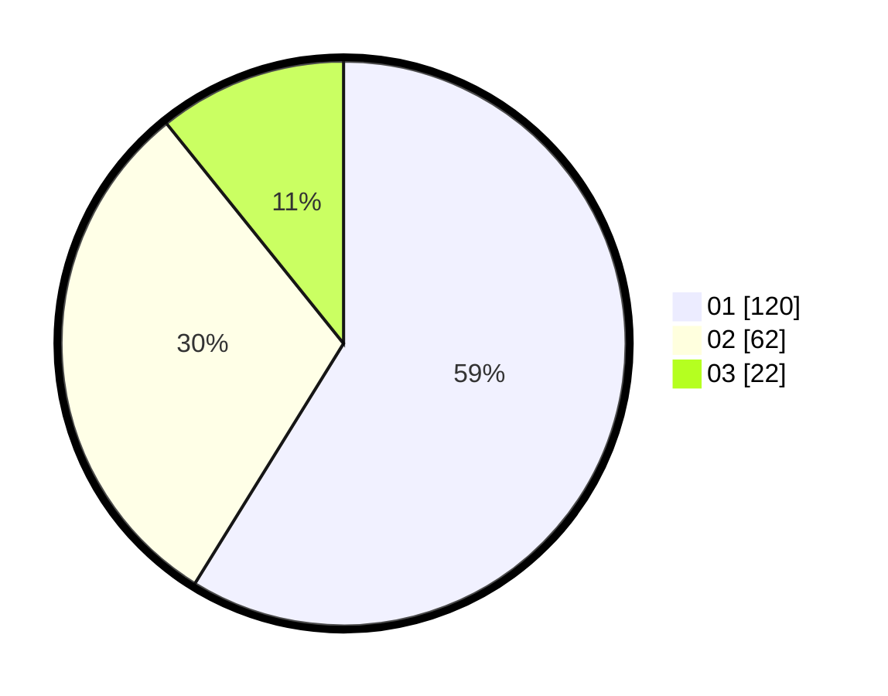

# Hasil

Hasil perolehan suara paslon dapat dilihat pada file paslon-01.txt, paslon-02.txt, dan paslon-03.txt.

Jika tidak ada, artinya data tersebut belum ada pada SIREKAP.

## Perolehan Suara

 * Paslon 01: **120**.
 * Paslon 02: **62**.
 * Paslon 03: **22**.

## Foto C Plano

https://sirekap-obj-formc.kpu.go.id/7a2c/pemilu/ppwp/31/73/05/10/03/3173051003115-20240215-013423--7f24770c-6745-42b7-afcc-41e4d1fecf7b.jpg

https://sirekap-obj-formc.kpu.go.id/7a2c/pemilu/ppwp/31/73/05/10/03/3173051003115-20240215-013611--063b2277-0c1d-4a12-a157-288411d818ad.jpg

https://sirekap-obj-formc.kpu.go.id/7a2c/pemilu/ppwp/31/73/05/10/03/3173051003115-20240215-013836--7e1751f7-62f2-4498-827e-e88f74198618.jpg
