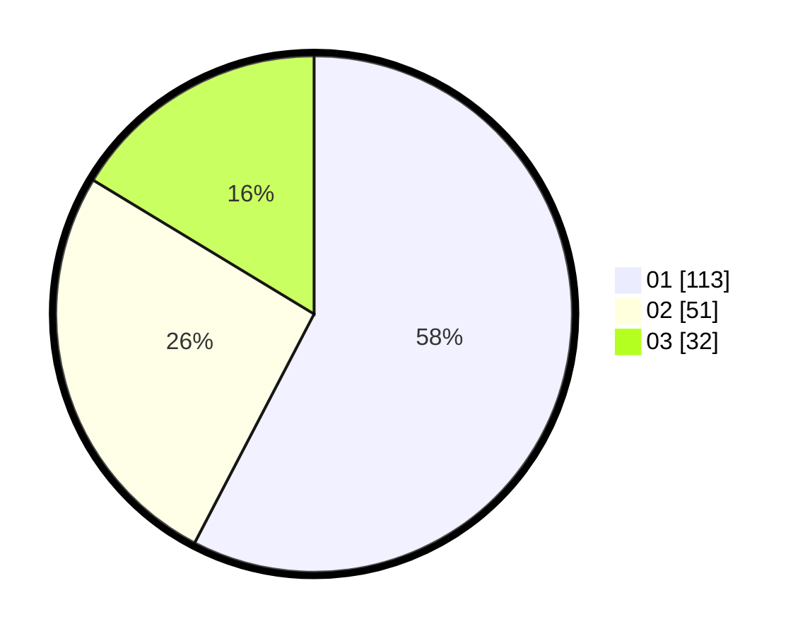

# Hasil

Hasil perolehan suara paslon dapat dilihat pada file paslon-01.txt, paslon-02.txt, dan paslon-03.txt.

Jika tidak ada, artinya data tersebut belum ada pada SIREKAP.

## Perolehan Suara

 * Paslon 01: **113**.
 * Paslon 02: **51**.
 * Paslon 03: **32**.

## Foto C Plano

https://sirekap-obj-formc.kpu.go.id/833e/pemilu/ppwp/31/73/05/10/03/3173051003118-20240216-121903--dc0aeeba-a80e-4e9b-8ecd-87d1053d8a14.jpg

https://sirekap-obj-formc.kpu.go.id/833e/pemilu/ppwp/31/73/05/10/03/3173051003118-20240216-121905--1f49614b-fb97-4037-b472-268cd6b949cd.jpg

https://sirekap-obj-formc.kpu.go.id/833e/pemilu/ppwp/31/73/05/10/03/3173051003118-20240216-121904--8a300b67-8c14-4e30-956a-ea68ff4e510f.jpg

## DATA PEMILIH TETAP

Jumlah pemilih dalam DPT: **260**.
 * L: **132**.
 * P: **128**.

## DATA PENGGUNA HAK PILIH

Jumlah pengguna hak pilih dalam DPT: **198**.
 * L: **96**.
 * P: **102**.

Jumlah pengguna hak pilih dalam DPTb: **2**.
 * L: **1**.
 * P: **1**.

Jumlah pengguna hak pilih dalam DPK: **0**.
 * L: **0**.
 * P: **0**.

Jumlah pengguna hak pilih: **200**.
 * L: **97**.
 * P: **103**.

## JUMLAH SUARA SAH DAN TIDAK SAH

JUMLAH SELURUH SUARA SAH: **196**.

JUMLAH SUARA TIDAK SAH: **4**.

JUMLAH SELURUH SUARA SAH DAN SUARA TIDAK SAH: **200**.
