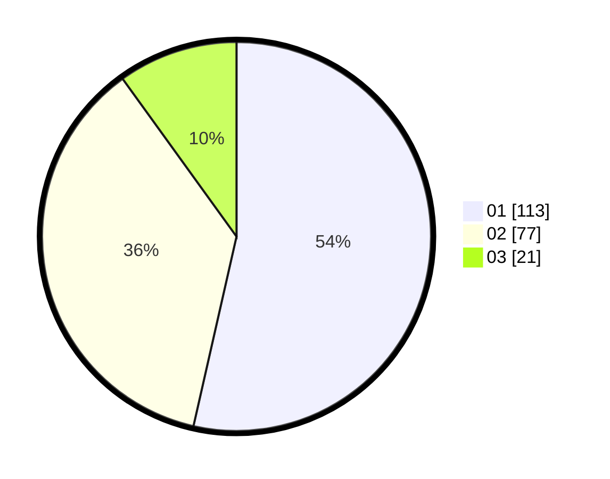

# Hasil

Hasil perolehan suara paslon dapat dilihat pada file paslon-01.txt, paslon-02.txt, dan paslon-03.txt.

Jika tidak ada, artinya data tersebut belum ada pada SIREKAP.

## Perolehan Suara

 * Paslon 01: **113**.
 * Paslon 02: **77**.
 * Paslon 03: **21**.

## Foto C Plano

https://sirekap-obj-formc.kpu.go.id/ba6e/pemilu/ppwp/31/73/05/10/03/3173051003119-20240216-151631--affecbd5-fe3b-4392-b7ee-acbb93766c41.jpg

https://sirekap-obj-formc.kpu.go.id/ba6e/pemilu/ppwp/31/73/05/10/03/3173051003119-20240216-151632--39fd2f30-0ecd-4736-a0ff-5953c7506c39.jpg

https://sirekap-obj-formc.kpu.go.id/ba6e/pemilu/ppwp/31/73/05/10/03/3173051003119-20240216-151631--f50cef7e-dbf8-4dbf-a0ef-209c624fc643.jpg

## DATA PEMILIH TETAP

Jumlah pemilih dalam DPT: **272**.
 * L: **146**.
 * P: **126**.

## DATA PENGGUNA HAK PILIH

Jumlah pengguna hak pilih dalam DPT: **211**.
 * L: **110**.
 * P: **101**.

Jumlah pengguna hak pilih dalam DPTb: **0**.
 * L: **0**.
 * P: **0**.

Jumlah pengguna hak pilih dalam DPK: **2**.
 * L: **0**.
 * P: **2**.

Jumlah pengguna hak pilih: **213**.
 * L: **110**.
 * P: **103**.

## JUMLAH SUARA SAH DAN TIDAK SAH

JUMLAH SELURUH SUARA SAH: **211**.

JUMLAH SUARA TIDAK SAH: **2**.

JUMLAH SELURUH SUARA SAH DAN SUARA TIDAK SAH: **213**.
