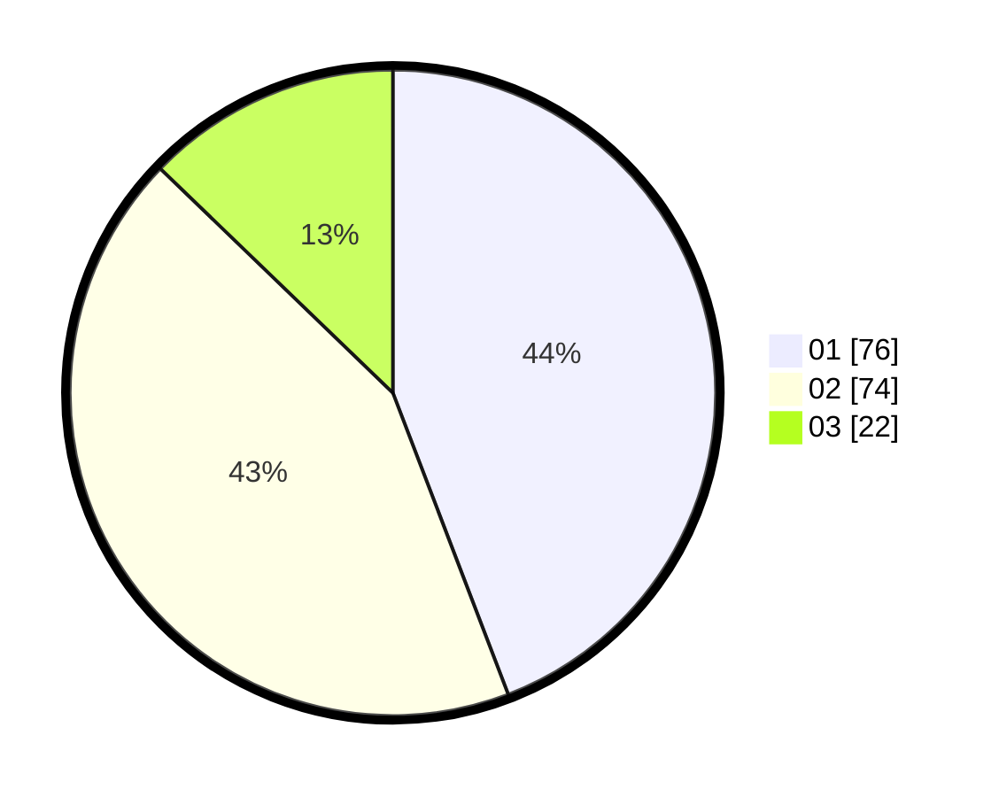

# Hasil

Hasil perolehan suara paslon dapat dilihat pada file paslon-01.txt, paslon-02.txt, dan paslon-03.txt.

Jika tidak ada, artinya data tersebut belum ada pada SIREKAP.

## Perolehan Suara

 * Paslon 01: **76**.
 * Paslon 02: **74**.
 * Paslon 03: **22**.

## Foto C Plano

https://sirekap-obj-formc.kpu.go.id/15d7/pemilu/ppwp/31/73/05/10/03/3173051003120-20240214-191704--156eabf4-dbc7-4afe-ab98-9d399da70e8a.jpg

https://sirekap-obj-formc.kpu.go.id/15d7/pemilu/ppwp/31/73/05/10/03/3173051003120-20240214-235425--f7144a56-b35e-4948-bac9-dfd119137374.jpg

https://sirekap-obj-formc.kpu.go.id/15d7/pemilu/ppwp/31/73/05/10/03/3173051003120-20240214-235604--d17b69f6-f271-4610-9995-56fb30cfd92e.jpg

## DATA PEMILIH TETAP

Jumlah pemilih dalam DPT: **240**.
 * L: **115**.
 * P: **125**.

## DATA PENGGUNA HAK PILIH

Jumlah pengguna hak pilih dalam DPT: **170**.
 * L: **76**.
 * P: **94**.

Jumlah pengguna hak pilih dalam DPTb: **0**.
 * L: **0**.
 * P: **0**.

Jumlah pengguna hak pilih dalam DPK: **3**.
 * L: **1**.
 * P: **2**.

Jumlah pengguna hak pilih: **173**.
 * L: **77**.
 * P: **96**.

## JUMLAH SUARA SAH DAN TIDAK SAH

JUMLAH SELURUH SUARA SAH: **172**.

JUMLAH SUARA TIDAK SAH: **1**.

JUMLAH SELURUH SUARA SAH DAN SUARA TIDAK SAH: **173**.
