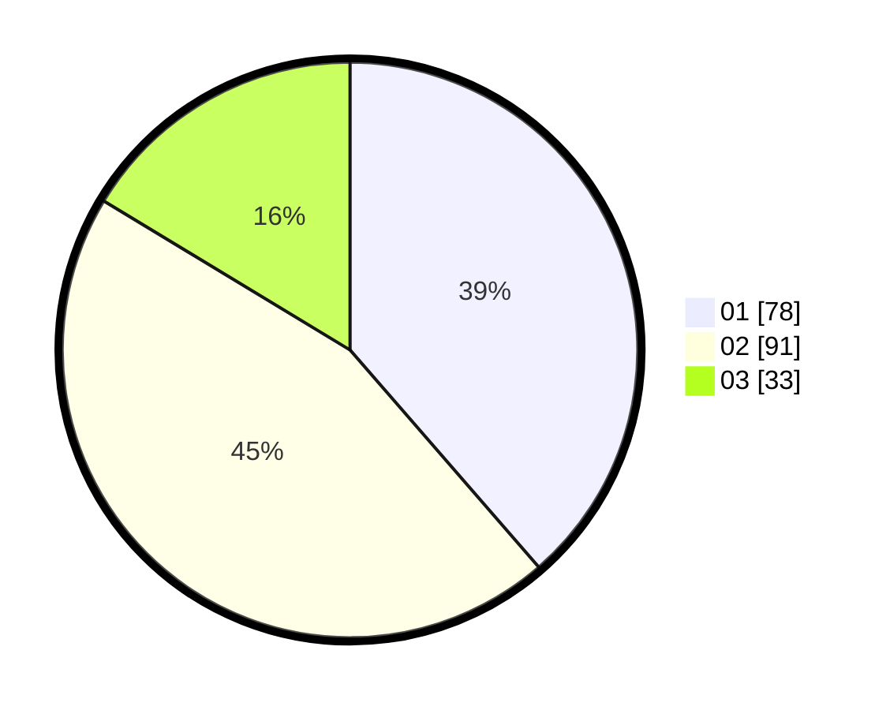

# Hasil

Hasil perolehan suara paslon dapat dilihat pada file paslon-01.txt, paslon-02.txt, dan paslon-03.txt.

Jika tidak ada, artinya data tersebut belum ada pada SIREKAP.

## Perolehan Suara

 * Paslon 01: **78**.
 * Paslon 02: **91**.
 * Paslon 03: **33**.

## Foto C Plano

https://sirekap-obj-formc.kpu.go.id/89b2/pemilu/ppwp/31/73/05/10/03/3173051003122-20240214-212957--016b31e4-02d5-424b-acac-c0fcf726c00f.jpg

https://sirekap-obj-formc.kpu.go.id/89b2/pemilu/ppwp/31/73/05/10/03/3173051003122-20240214-213212--b0d3f79f-35e8-40d2-a731-ce03f863e8ff.jpg

https://sirekap-obj-formc.kpu.go.id/89b2/pemilu/ppwp/31/73/05/10/03/3173051003122-20240214-213042--4a02ab81-9d76-49c1-a2b2-91e54d8ce3d3.jpg

## DATA PEMILIH TETAP

Jumlah pemilih dalam DPT: **277**.
 * L: **144**.
 * P: **133**.

## DATA PENGGUNA HAK PILIH

Jumlah pengguna hak pilih dalam DPT: **202**.
 * L: **96**.
 * P: **106**.

Jumlah pengguna hak pilih dalam DPTb: **0**.
 * L: **0**.
 * P: **0**.

Jumlah pengguna hak pilih dalam DPK: **0**.
 * L: **0**.
 * P: **0**.

Jumlah pengguna hak pilih: **202**.
 * L: **97**.
 * P: **105**.

## JUMLAH SUARA SAH DAN TIDAK SAH

JUMLAH SELURUH SUARA SAH: **202**.

JUMLAH SUARA TIDAK SAH: **0**.

JUMLAH SELURUH SUARA SAH DAN SUARA TIDAK SAH: **202**.
