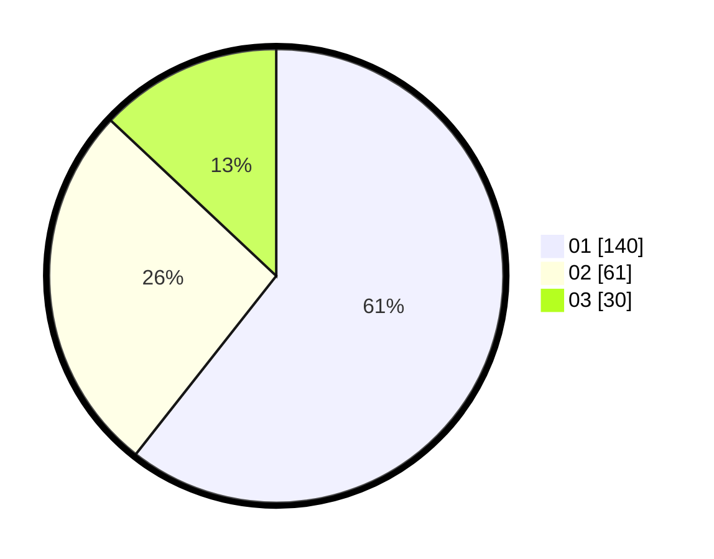

# Hasil

Hasil perolehan suara paslon dapat dilihat pada file paslon-01.txt, paslon-02.txt, dan paslon-03.txt.

Jika tidak ada, artinya data tersebut belum ada pada SIREKAP.

## Perolehan Suara

 * Paslon 01: **140**.
 * Paslon 02: **61**.
 * Paslon 03: **30**.

## Foto C Plano

https://sirekap-obj-formc.kpu.go.id/82ea/pemilu/ppwp/31/73/05/10/03/3173051003124-20240216-110444--4354b7b1-01d1-4b04-9524-5a472d42e14b.jpg

https://sirekap-obj-formc.kpu.go.id/82ea/pemilu/ppwp/31/73/05/10/03/3173051003124-20240216-105135--f40858fb-4ef2-492e-9f55-a5fc658dfd73.jpg

https://sirekap-obj-formc.kpu.go.id/82ea/pemilu/ppwp/31/73/05/10/03/3173051003124-20240216-105129--02e5f486-e6fd-4105-ba70-e4387b83fc06.jpg

## DATA PEMILIH TETAP

Jumlah pemilih dalam DPT: **292**.
 * L: **154**.
 * P: **138**.

## DATA PENGGUNA HAK PILIH

Jumlah pengguna hak pilih dalam DPT: **234**.
 * L: **114**.
 * P: **120**.

Jumlah pengguna hak pilih dalam DPTb: **1**.
 * L: **1**.
 * P: **0**.

Jumlah pengguna hak pilih dalam DPK: **2**.
 * L: **1**.
 * P: **1**.

Jumlah pengguna hak pilih: **237**.
 * L: **116**.
 * P: **121**.

## JUMLAH SUARA SAH DAN TIDAK SAH

JUMLAH SELURUH SUARA SAH: **231**.

JUMLAH SUARA TIDAK SAH: **6**.

JUMLAH SELURUH SUARA SAH DAN SUARA TIDAK SAH: **237**.
