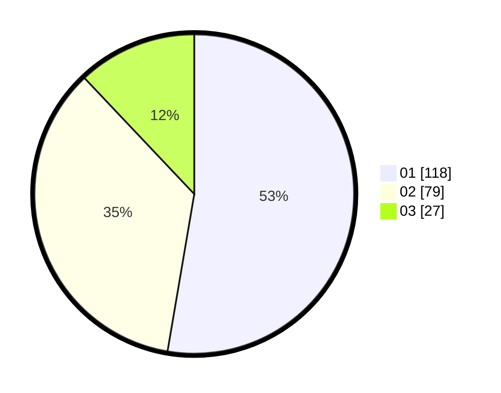

# Hasil

Hasil perolehan suara paslon dapat dilihat pada file paslon-01.txt, paslon-02.txt, dan paslon-03.txt.

Jika tidak ada, artinya data tersebut belum ada pada SIREKAP.

## Perolehan Suara

 * Paslon 01: **118**.
 * Paslon 02: **79**.
 * Paslon 03: **27**.

## Foto C Plano

https://sirekap-obj-formc.kpu.go.id/0a56/pemilu/ppwp/31/73/05/10/03/3173051003125-20240214-233703--75f3211e-048f-40ec-8361-c141b9ea2983.jpg

https://sirekap-obj-formc.kpu.go.id/0a56/pemilu/ppwp/31/73/05/10/03/3173051003125-20240214-233709--d711a45a-d0a4-4dd7-a56c-fa95bb0e0a16.jpg

https://sirekap-obj-formc.kpu.go.id/0a56/pemilu/ppwp/31/73/05/10/03/3173051003125-20240214-233714--a40ffd33-5152-4a4f-9b62-832be0f384e1.jpg
