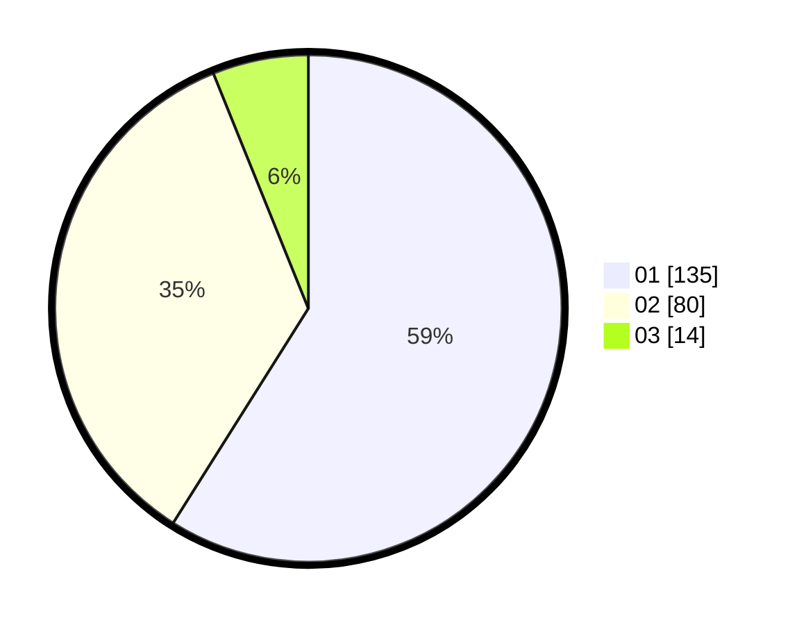

# Hasil

Hasil perolehan suara paslon dapat dilihat pada file paslon-01.txt, paslon-02.txt, dan paslon-03.txt.

Jika tidak ada, artinya data tersebut belum ada pada SIREKAP.

## Perolehan Suara

 * Paslon 01: **135**.
 * Paslon 02: **80**.
 * Paslon 03: **14**.

## Foto C Plano

https://sirekap-obj-formc.kpu.go.id/670e/pemilu/ppwp/31/73/05/10/03/3173051003129-20240215-005155--a1ee5cac-228c-4099-9c34-c266af09743a.jpg

https://sirekap-obj-formc.kpu.go.id/670e/pemilu/ppwp/31/73/05/10/03/3173051003129-20240215-005412--d9c1238d-a088-40de-b863-1a48977c8862.jpg

https://sirekap-obj-formc.kpu.go.id/670e/pemilu/ppwp/31/73/05/10/03/3173051003129-20240215-005518--778b50ea-c516-4891-8e1a-c9b575e56746.jpg
