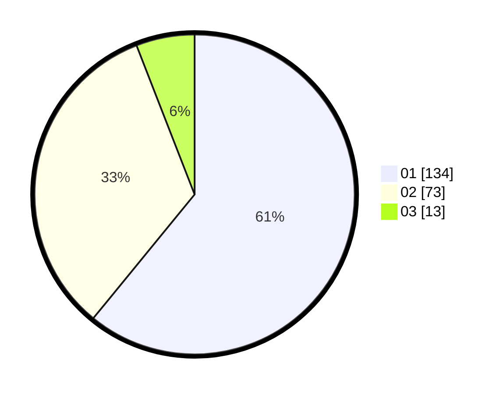

# Hasil

Hasil perolehan suara paslon dapat dilihat pada file paslon-01.txt, paslon-02.txt, dan paslon-03.txt.

Jika tidak ada, artinya data tersebut belum ada pada SIREKAP.

## Perolehan Suara

 * Paslon 01: **134**.
 * Paslon 02: **73**.
 * Paslon 03: **13**.

## Foto C Plano

https://sirekap-obj-formc.kpu.go.id/f84b/pemilu/ppwp/31/73/05/10/04/3173051004004-20240216-052326--4ca9bb4a-4aee-4ed0-902b-5ec06bd85697.jpg

https://sirekap-obj-formc.kpu.go.id/f84b/pemilu/ppwp/31/73/05/10/04/3173051004004-20240216-051031--9f44aebc-d2fa-4c0d-ba69-e2f1ceb537e1.jpg

https://sirekap-obj-formc.kpu.go.id/f84b/pemilu/ppwp/31/73/05/10/04/3173051004004-20240216-052334--2b60452e-0519-40af-b414-fba67def6a76.jpg

## DATA PEMILIH TETAP

Jumlah pemilih dalam DPT: **278**.
 * L: **143**.
 * P: **135**.

## DATA PENGGUNA HAK PILIH

Jumlah pengguna hak pilih dalam DPT: **217**.
 * L: **110**.
 * P: **107**.

Jumlah pengguna hak pilih dalam DPTb: **3**.
 * L: **2**.
 * P: **1**.

Jumlah pengguna hak pilih dalam DPK: **2**.
 * L: **1**.
 * P: **1**.

Jumlah pengguna hak pilih: **222**.
 * L: **113**.
 * P: **109**.

## JUMLAH SUARA SAH DAN TIDAK SAH

JUMLAH SELURUH SUARA SAH: **220**.

JUMLAH SUARA TIDAK SAH: **2**.

JUMLAH SELURUH SUARA SAH DAN SUARA TIDAK SAH: **222**.
