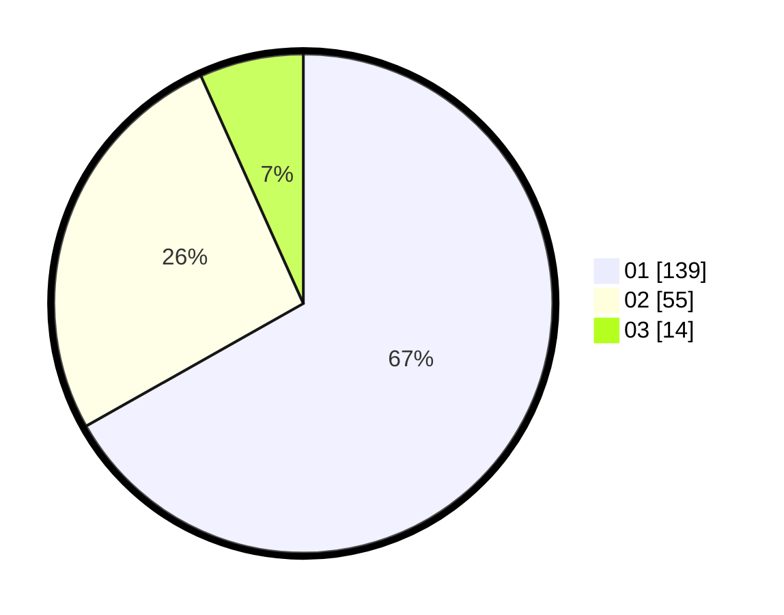

# Hasil

Hasil perolehan suara paslon dapat dilihat pada file paslon-01.txt, paslon-02.txt, dan paslon-03.txt.

Jika tidak ada, artinya data tersebut belum ada pada SIREKAP.

## Perolehan Suara

 * Paslon 01: **139**.
 * Paslon 02: **55**.
 * Paslon 03: **14**.

## Foto C Plano

https://sirekap-obj-formc.kpu.go.id/8845/pemilu/ppwp/31/73/05/10/04/3173051004008-20240214-234944--8111ab4b-bbab-40a7-9268-f0ef5c155d80.jpg

https://sirekap-obj-formc.kpu.go.id/8845/pemilu/ppwp/31/73/05/10/04/3173051004008-20240214-220518--4543a773-a2aa-4c66-869e-cab34ba945df.jpg

https://sirekap-obj-formc.kpu.go.id/8845/pemilu/ppwp/31/73/05/10/04/3173051004008-20240214-220635--3c84cd35-bfc5-4429-83c0-b1072fc38545.jpg
