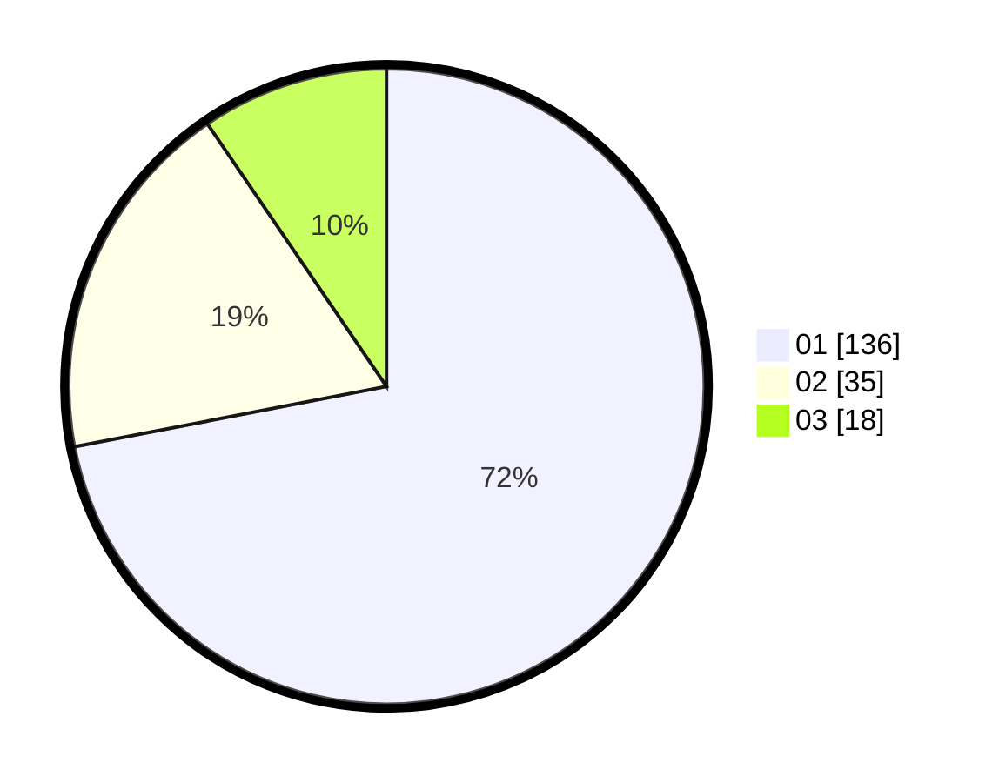

# Hasil

Hasil perolehan suara paslon dapat dilihat pada file paslon-01.txt, paslon-02.txt, dan paslon-03.txt.

Jika tidak ada, artinya data tersebut belum ada pada SIREKAP.

## Perolehan Suara

 * Paslon 01: **136**.
 * Paslon 02: **35**.
 * Paslon 03: **18**.

## Foto C Plano

https://sirekap-obj-formc.kpu.go.id/daf8/pemilu/ppwp/31/73/05/10/04/3173051004009-20240214-213645--ad4a0af4-311b-4ffc-84f1-0de338e330e5.jpg

https://sirekap-obj-formc.kpu.go.id/daf8/pemilu/ppwp/31/73/05/10/04/3173051004009-20240214-213651--15a7d049-6ff5-4ba6-8dfd-9aa0cf047a53.jpg

https://sirekap-obj-formc.kpu.go.id/daf8/pemilu/ppwp/31/73/05/10/04/3173051004009-20240214-213656--57b869c6-b80b-4d85-9612-b67d7af72c87.jpg
