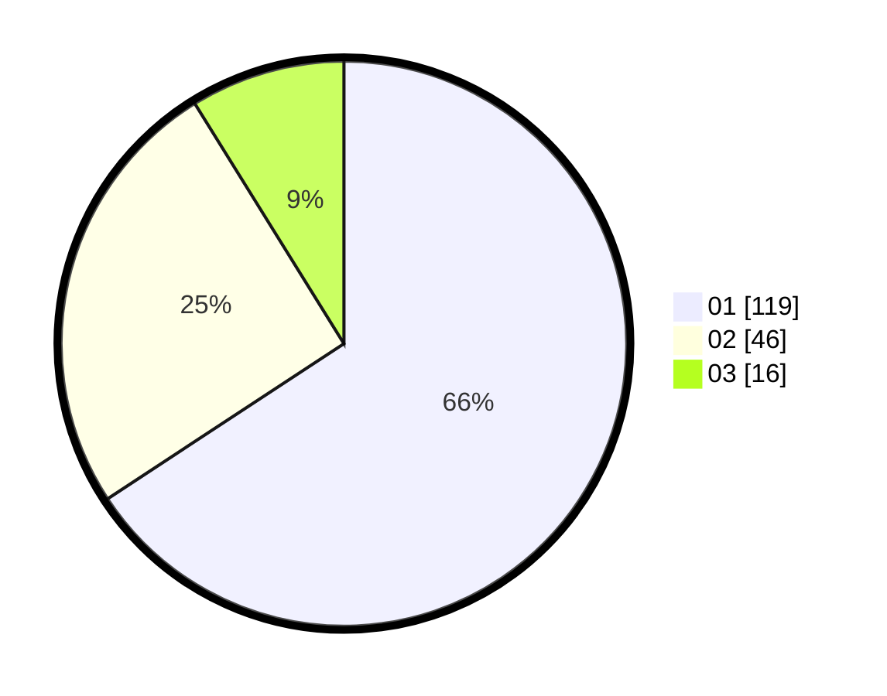

# Hasil

Hasil perolehan suara paslon dapat dilihat pada file paslon-01.txt, paslon-02.txt, dan paslon-03.txt.

Jika tidak ada, artinya data tersebut belum ada pada SIREKAP.

## Perolehan Suara

 * Paslon 01: **119**.
 * Paslon 02: **46**.
 * Paslon 03: **16**.

## Foto C Plano

https://sirekap-obj-formc.kpu.go.id/bce5/pemilu/ppwp/31/73/05/10/04/3173051004010-20240214-222646--d544b914-cfcc-4a3d-8da5-2d995b0bee94.jpg

https://sirekap-obj-formc.kpu.go.id/bce5/pemilu/ppwp/31/73/05/10/04/3173051004010-20240214-230616--ae2786e2-6106-45ca-a096-759eb02f4e52.jpg

https://sirekap-obj-formc.kpu.go.id/bce5/pemilu/ppwp/31/73/05/10/04/3173051004010-20240214-230801--3358188e-1bcb-4a54-bf8f-de1d60b55492.jpg
