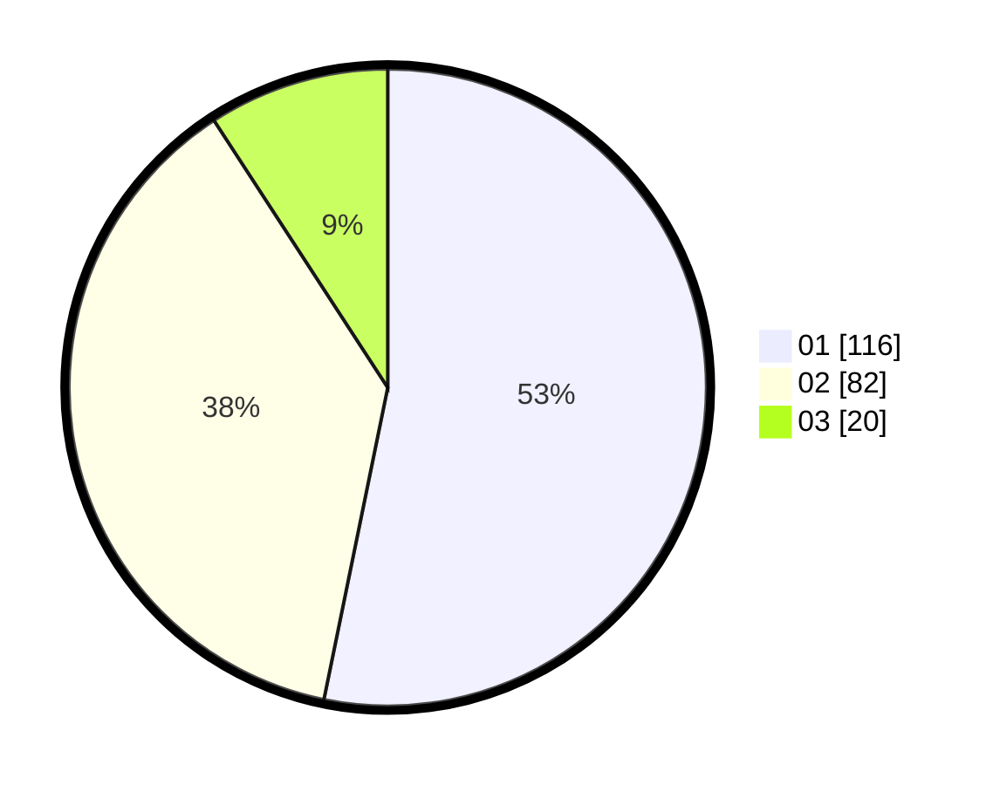

# Hasil

Hasil perolehan suara paslon dapat dilihat pada file paslon-01.txt, paslon-02.txt, dan paslon-03.txt.

Jika tidak ada, artinya data tersebut belum ada pada SIREKAP.

## Perolehan Suara

 * Paslon 01: **116**.
 * Paslon 02: **82**.
 * Paslon 03: **20**.

## Foto C Plano

https://sirekap-obj-formc.kpu.go.id/4dcf/pemilu/ppwp/31/73/05/10/04/3173051004017-20240214-211909--ba9162c4-387d-4848-9d3b-5d7e57b175c0.jpg

https://sirekap-obj-formc.kpu.go.id/4dcf/pemilu/ppwp/31/73/05/10/04/3173051004017-20240214-222042--4b368273-b50a-4734-9b95-99370a8352b7.jpg

https://sirekap-obj-formc.kpu.go.id/4dcf/pemilu/ppwp/31/73/05/10/04/3173051004017-20240214-222258--ab55a02f-f9af-48bf-9b26-ee3d02e7b221.jpg
