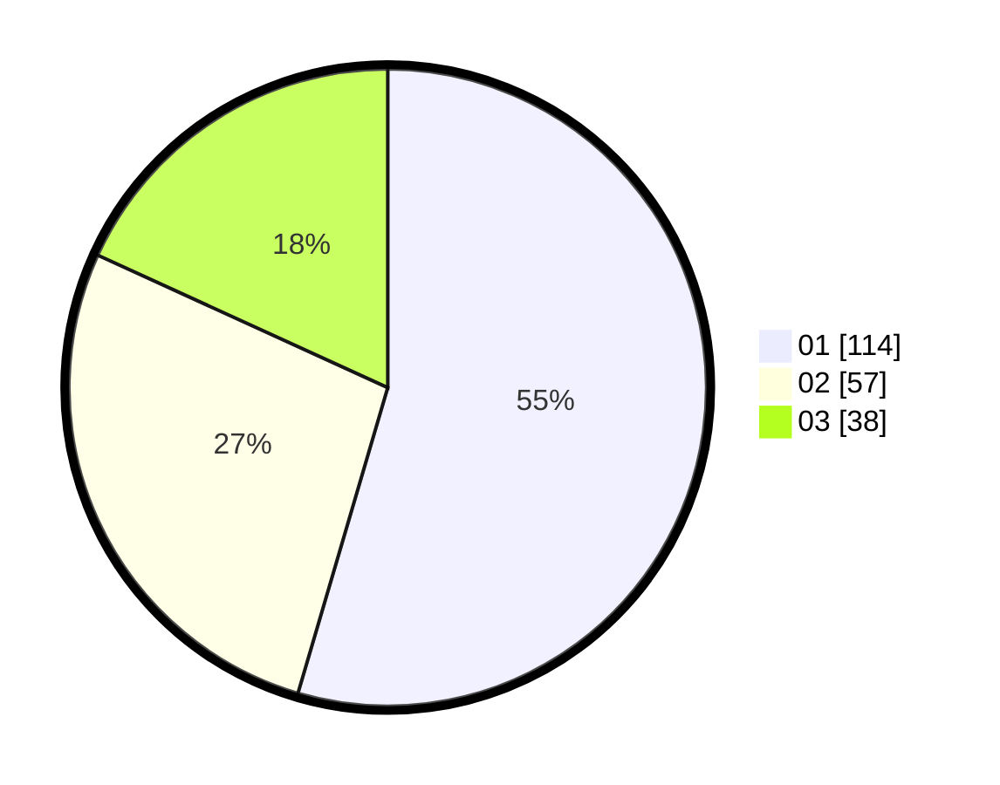

# Hasil

Hasil perolehan suara paslon dapat dilihat pada file paslon-01.txt, paslon-02.txt, dan paslon-03.txt.

Jika tidak ada, artinya data tersebut belum ada pada SIREKAP.

## Perolehan Suara

 * Paslon 01: **114**.
 * Paslon 02: **57**.
 * Paslon 03: **38**.

## Foto C Plano

https://sirekap-obj-formc.kpu.go.id/2925/pemilu/ppwp/31/73/05/10/04/3173051004023-20240215-014945--09ae0c2d-6408-4964-9096-ef7f8e977a65.jpg

https://sirekap-obj-formc.kpu.go.id/2925/pemilu/ppwp/31/73/05/10/04/3173051004023-20240215-015016--9d4ad3f5-15c5-4c12-b6e7-0006b8a7fa9c.jpg
