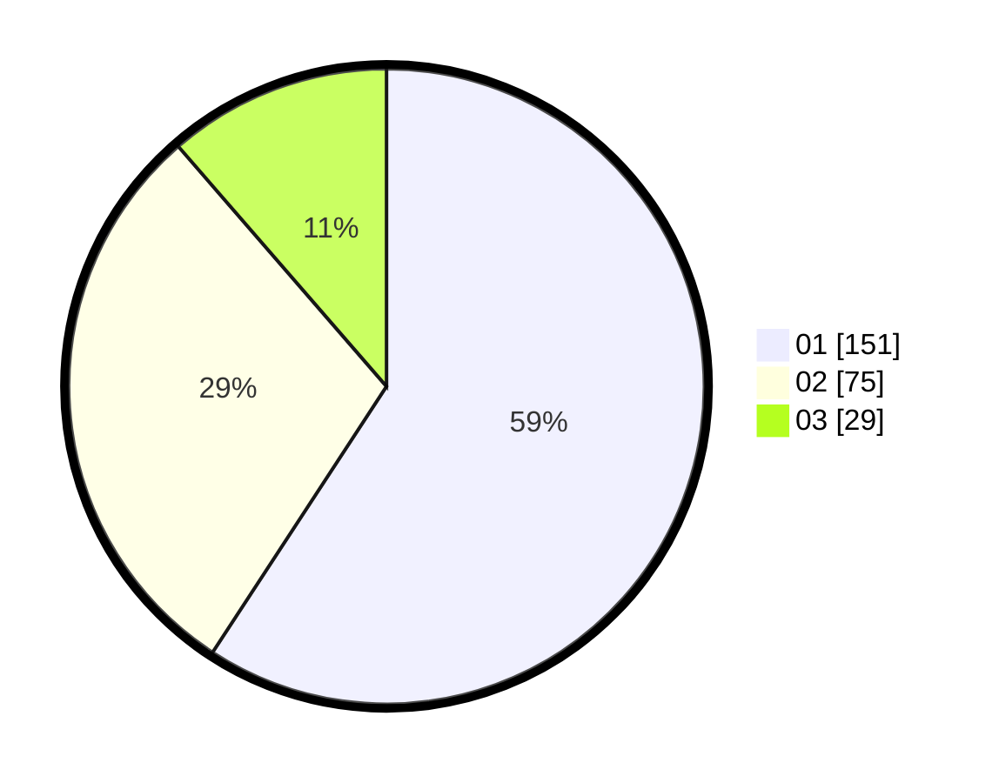

# Hasil

Hasil perolehan suara paslon dapat dilihat pada file paslon-01.txt, paslon-02.txt, dan paslon-03.txt.

Jika tidak ada, artinya data tersebut belum ada pada SIREKAP.

## Perolehan Suara

 * Paslon 01: **151**.
 * Paslon 02: **75**.
 * Paslon 03: **29**.

## Foto C Plano

https://sirekap-obj-formc.kpu.go.id/0974/pemilu/ppwp/31/73/05/10/04/3173051004024-20240214-192950--a03433a4-464a-496d-b482-9a708d325b38.jpg

https://sirekap-obj-formc.kpu.go.id/0974/pemilu/ppwp/31/73/05/10/04/3173051004024-20240214-192736--cc399363-9c80-4c31-8350-1a9ccc2da836.jpg

https://sirekap-obj-formc.kpu.go.id/0974/pemilu/ppwp/31/73/05/10/04/3173051004024-20240214-193334--2c53b6c5-1ecd-437b-bccf-0660139ec8d9.jpg
