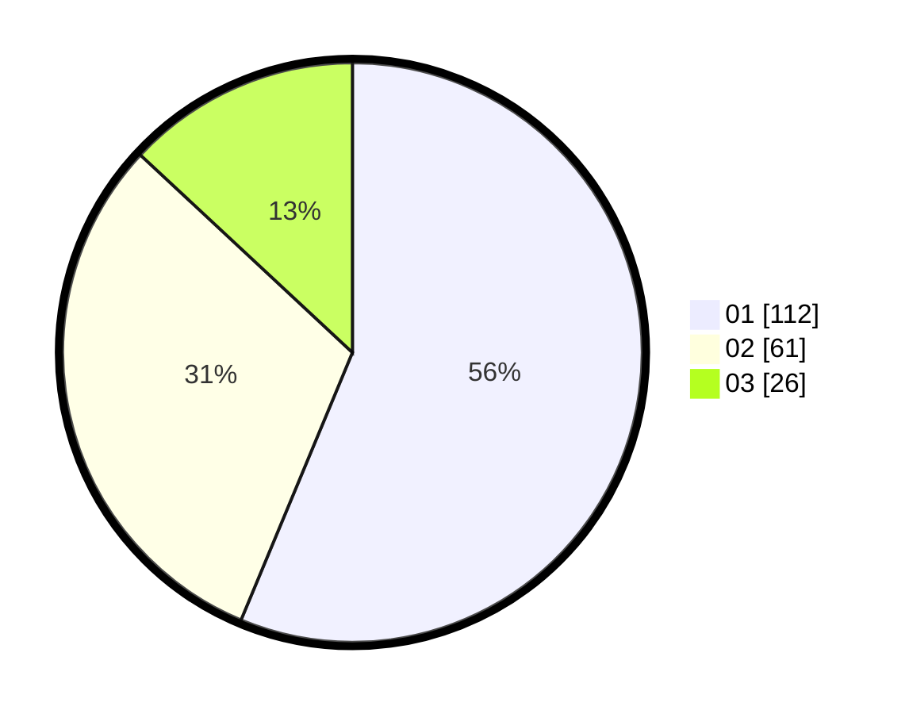

# Hasil

Hasil perolehan suara paslon dapat dilihat pada file paslon-01.txt, paslon-02.txt, dan paslon-03.txt.

Jika tidak ada, artinya data tersebut belum ada pada SIREKAP.

## Perolehan Suara

 * Paslon 01: **112**.
 * Paslon 02: **61**.
 * Paslon 03: **26**.

## Foto C Plano

https://sirekap-obj-formc.kpu.go.id/3d80/pemilu/ppwp/31/73/05/10/04/3173051004031-20240215-030805--08dc59d7-0aca-4201-84ff-0833d3144eb7.jpg

https://sirekap-obj-formc.kpu.go.id/3d80/pemilu/ppwp/31/73/05/10/04/3173051004031-20240215-030811--ccdd74c0-4197-4b8f-a0b0-9c21a3eaa52c.jpg

https://sirekap-obj-formc.kpu.go.id/3d80/pemilu/ppwp/31/73/05/10/04/3173051004031-20240215-030815--8a581338-d2fa-4262-9a10-2327d159bb09.jpg

## DATA PEMILIH TETAP

Jumlah pemilih dalam DPT: **250**.
 * L: **130**.
 * P: **120**.

## DATA PENGGUNA HAK PILIH

Jumlah pengguna hak pilih dalam DPT: **182**.
 * L: **89**.
 * P: **93**.

Jumlah pengguna hak pilih dalam DPTb: **4**.
 * L: **2**.
 * P: **2**.

Jumlah pengguna hak pilih dalam DPK: **14**.
 * L: **6**.
 * P: **8**.

Jumlah pengguna hak pilih: **200**.
 * L: **97**.
 * P: **103**.

## JUMLAH SUARA SAH DAN TIDAK SAH

JUMLAH SELURUH SUARA SAH: **199**.

JUMLAH SUARA TIDAK SAH: **1**.

JUMLAH SELURUH SUARA SAH DAN SUARA TIDAK SAH: **200**.
