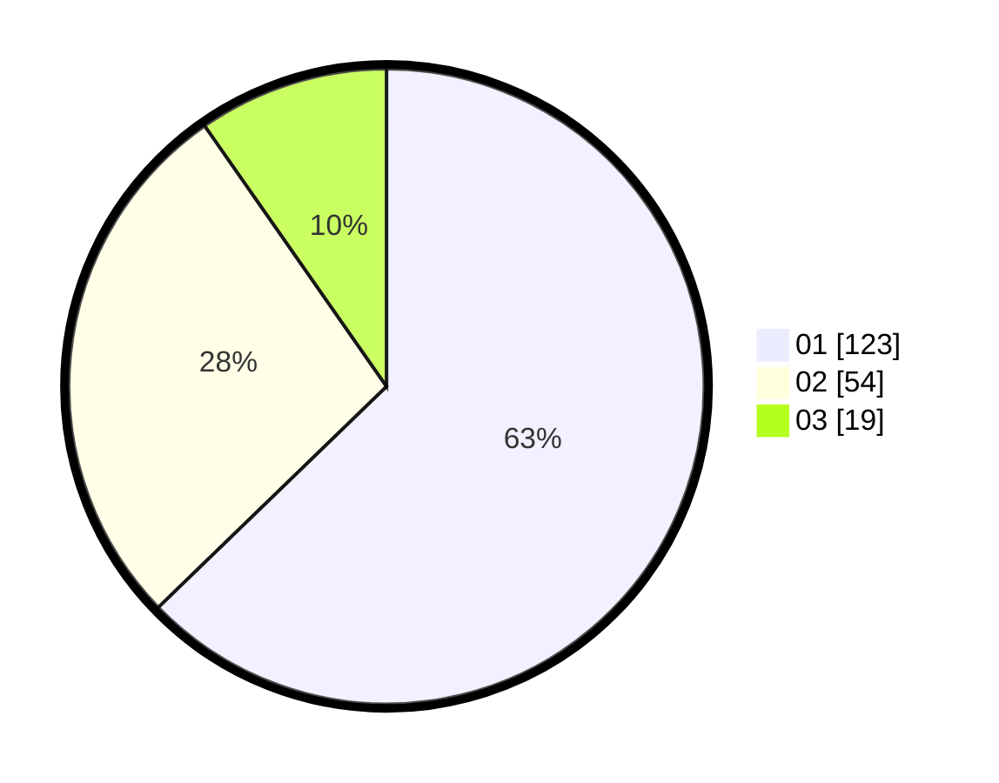

# Hasil

Hasil perolehan suara paslon dapat dilihat pada file paslon-01.txt, paslon-02.txt, dan paslon-03.txt.

Jika tidak ada, artinya data tersebut belum ada pada SIREKAP.

## Perolehan Suara

 * Paslon 01: **123**.
 * Paslon 02: **54**.
 * Paslon 03: **19**.

## Foto C Plano

https://sirekap-obj-formc.kpu.go.id/e217/pemilu/ppwp/31/73/05/10/04/3173051004032-20240214-195122--0eb1371b-0f96-4c93-8846-1bb7c8181609.jpg

https://sirekap-obj-formc.kpu.go.id/e217/pemilu/ppwp/31/73/05/10/04/3173051004032-20240214-195202--2e42ec56-8e5c-4556-8ca8-fef4147c92be.jpg

https://sirekap-obj-formc.kpu.go.id/e217/pemilu/ppwp/31/73/05/10/04/3173051004032-20240214-195305--0878a08a-aa2e-4475-8068-82123c313b6e.jpg
