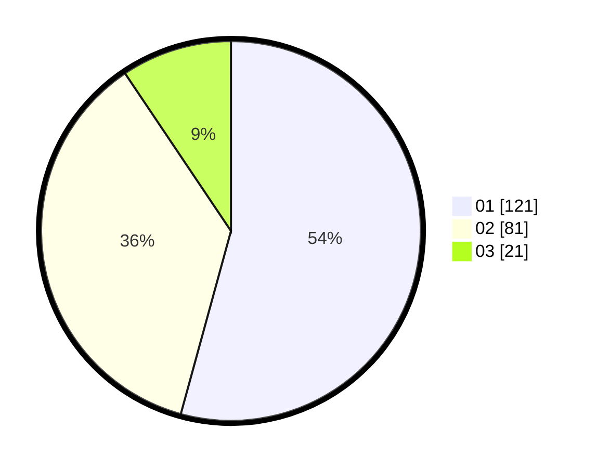

# Hasil

Hasil perolehan suara paslon dapat dilihat pada file paslon-01.txt, paslon-02.txt, dan paslon-03.txt.

Jika tidak ada, artinya data tersebut belum ada pada SIREKAP.

## Perolehan Suara

 * Paslon 01: **121**.
 * Paslon 02: **81**.
 * Paslon 03: **21**.

## Foto C Plano

https://sirekap-obj-formc.kpu.go.id/9661/pemilu/ppwp/31/73/05/10/04/3173051004033-20240215-012606--7159b0c5-e310-467a-9cd4-38ef5d372d18.jpg

https://sirekap-obj-formc.kpu.go.id/9661/pemilu/ppwp/31/73/05/10/04/3173051004033-20240215-012711--5f7ddea5-5b1d-4a0e-b47e-5b6a5fb7c7e2.jpg

https://sirekap-obj-formc.kpu.go.id/9661/pemilu/ppwp/31/73/05/10/04/3173051004033-20240215-012822--ba93a136-3f15-4872-b4f0-a6c2aa199552.jpg
