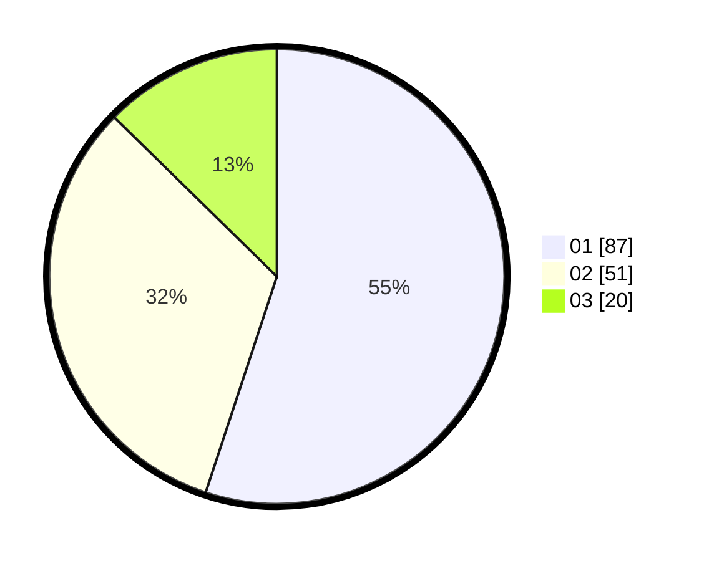

# Hasil

Hasil perolehan suara paslon dapat dilihat pada file paslon-01.txt, paslon-02.txt, dan paslon-03.txt.

Jika tidak ada, artinya data tersebut belum ada pada SIREKAP.

## Perolehan Suara

 * Paslon 01: **87**.
 * Paslon 02: **51**.
 * Paslon 03: **20**.

## Foto C Plano

https://sirekap-obj-formc.kpu.go.id/7d9c/pemilu/ppwp/31/73/05/10/04/3173051004037-20240214-211349--5fd0e3b9-4a11-4d21-98dc-308f7bf17c07.jpg

https://sirekap-obj-formc.kpu.go.id/7d9c/pemilu/ppwp/31/73/05/10/04/3173051004037-20240214-211806--8d7aeb2b-de37-4415-a1b5-5223cc05942f.jpg

https://sirekap-obj-formc.kpu.go.id/7d9c/pemilu/ppwp/31/73/05/10/04/3173051004037-20240214-195733--9492d83a-b76d-4923-9e93-9e499c33ec8a.jpg

## DATA PEMILIH TETAP

Jumlah pemilih dalam DPT: **196**.
 * L: **95**.
 * P: **101**.

## DATA PENGGUNA HAK PILIH

Jumlah pengguna hak pilih dalam DPT: **155**.
 * L: **76**.
 * P: **79**.

Jumlah pengguna hak pilih dalam DPTb: **3**.
 * L: **2**.
 * P: **1**.

Jumlah pengguna hak pilih dalam DPK: **2**.
 * L: **2**.
 * P: **0**.

Jumlah pengguna hak pilih: **160**.
 * L: **80**.
 * P: **80**.

## JUMLAH SUARA SAH DAN TIDAK SAH

JUMLAH SELURUH SUARA SAH: **158**.

JUMLAH SUARA TIDAK SAH: **2**.

JUMLAH SELURUH SUARA SAH DAN SUARA TIDAK SAH: **160**.
