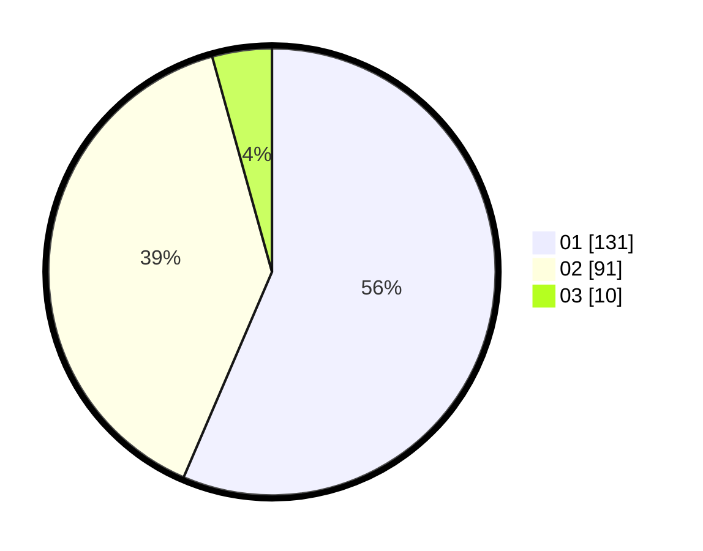

# Hasil

Hasil perolehan suara paslon dapat dilihat pada file paslon-01.txt, paslon-02.txt, dan paslon-03.txt.

Jika tidak ada, artinya data tersebut belum ada pada SIREKAP.

## Perolehan Suara

 * Paslon 01: **131**.
 * Paslon 02: **91**.
 * Paslon 03: **10**.

## Foto C Plano

https://sirekap-obj-formc.kpu.go.id/d743/pemilu/ppwp/31/73/05/10/04/3173051004055-20240215-001324--f7f4394d-bb3e-415e-bb00-91142ef4bd4f.jpg

https://sirekap-obj-formc.kpu.go.id/d743/pemilu/ppwp/31/73/05/10/04/3173051004055-20240215-001350--0e79b361-1a23-4e5f-b6bd-585fc51872c0.jpg

https://sirekap-obj-formc.kpu.go.id/d743/pemilu/ppwp/31/73/05/10/04/3173051004055-20240215-001409--6487bb1f-d2cf-4989-b685-2435278d2ff0.jpg
