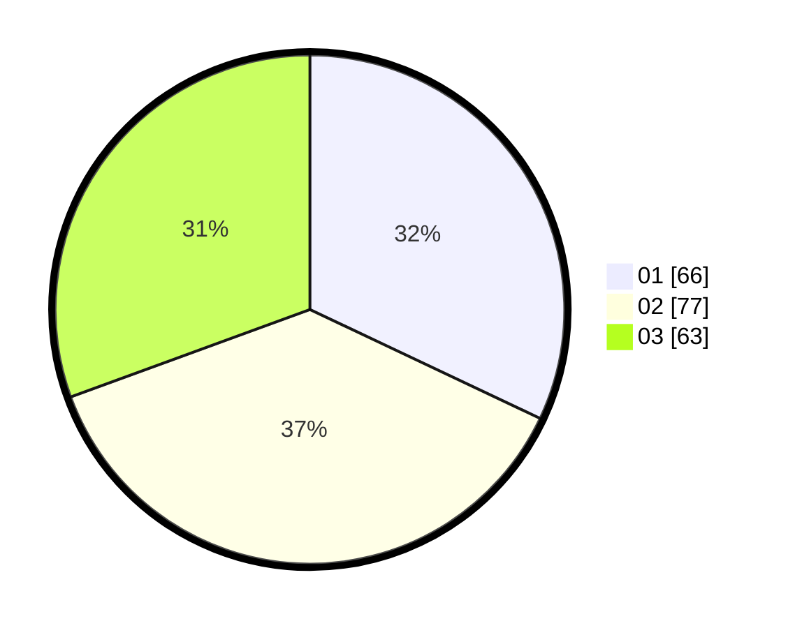

# Hasil

Hasil perolehan suara paslon dapat dilihat pada file paslon-01.txt, paslon-02.txt, dan paslon-03.txt.

Jika tidak ada, artinya data tersebut belum ada pada SIREKAP.

## Perolehan Suara

 * Paslon 01: **66**.
 * Paslon 02: **77**.
 * Paslon 03: **63**.

## Foto C Plano

https://sirekap-obj-formc.kpu.go.id/42be/pemilu/ppwp/31/73/05/10/04/3173051004061-20240215-025353--2ebc5411-ffec-4051-aa10-977a4171879b.jpg

https://sirekap-obj-formc.kpu.go.id/42be/pemilu/ppwp/31/73/05/10/04/3173051004061-20240215-042415--5c1e29fa-f603-4088-823e-9782a690a5a8.jpg
