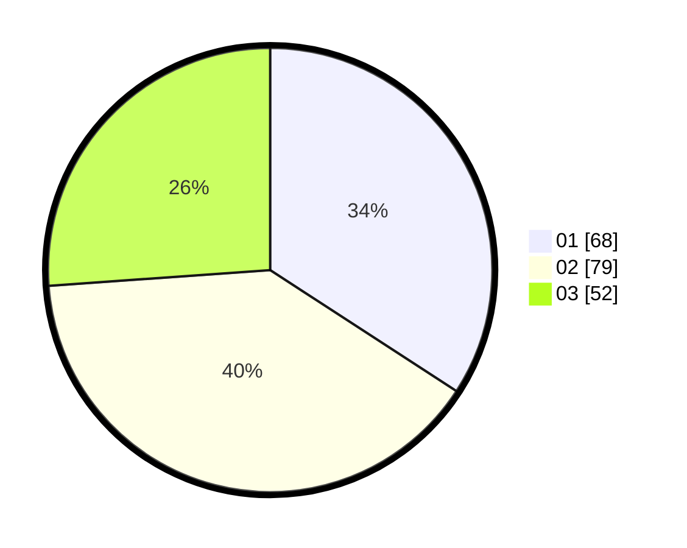

# Hasil

Hasil perolehan suara paslon dapat dilihat pada file paslon-01.txt, paslon-02.txt, dan paslon-03.txt.

Jika tidak ada, artinya data tersebut belum ada pada SIREKAP.

## Perolehan Suara

 * Paslon 01: **68**.
 * Paslon 02: **79**.
 * Paslon 03: **52**.

## Foto C Plano

https://sirekap-obj-formc.kpu.go.id/c72f/pemilu/ppwp/31/73/05/10/04/3173051004062-20240215-000103--ff5e917f-5584-41e8-bd7d-b355a3b398c0.jpg

https://sirekap-obj-formc.kpu.go.id/c72f/pemilu/ppwp/31/73/05/10/04/3173051004062-20240215-000139--7a33525b-be79-4361-b9a2-cbc04f3b3427.jpg
