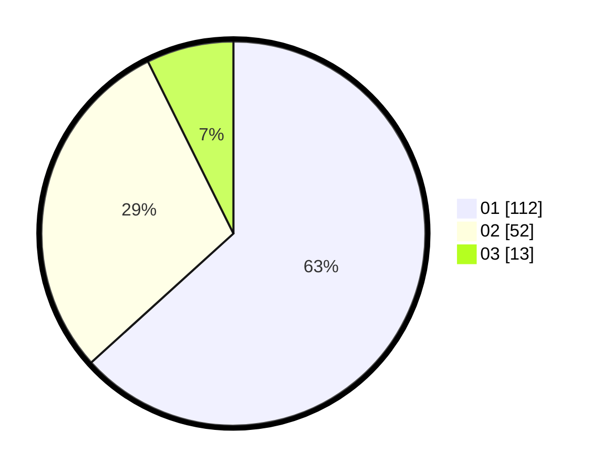

# Hasil

Hasil perolehan suara paslon dapat dilihat pada file paslon-01.txt, paslon-02.txt, dan paslon-03.txt.

Jika tidak ada, artinya data tersebut belum ada pada SIREKAP.

## Perolehan Suara

 * Paslon 01: **112**.
 * Paslon 02: **52**.
 * Paslon 03: **13**.

## Foto C Plano

https://sirekap-obj-formc.kpu.go.id/03d1/pemilu/ppwp/31/73/05/10/04/3173051004067-20240215-011304--ffe09379-475f-4155-b5ef-7d141b58c547.jpg

https://sirekap-obj-formc.kpu.go.id/03d1/pemilu/ppwp/31/73/05/10/04/3173051004067-20240215-010851--a311a3e9-0a6f-4759-bd8b-cee793cf9378.jpg

https://sirekap-obj-formc.kpu.go.id/03d1/pemilu/ppwp/31/73/05/10/04/3173051004067-20240215-011103--8d19abd1-91b9-446d-b665-0541c5041c5a.jpg
