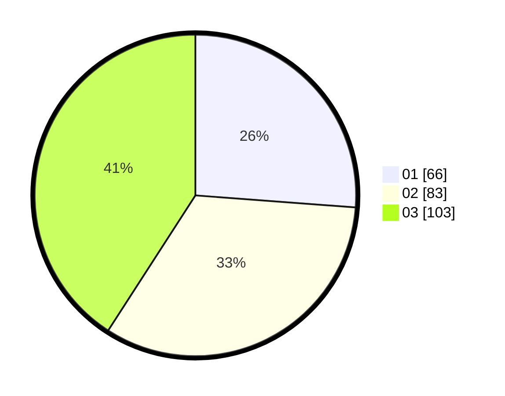

# Hasil

Hasil perolehan suara paslon dapat dilihat pada file paslon-01.txt, paslon-02.txt, dan paslon-03.txt.

Jika tidak ada, artinya data tersebut belum ada pada SIREKAP.

## Perolehan Suara

 * Paslon 01: **66**.
 * Paslon 02: **83**.
 * Paslon 03: **103**.

## Foto C Plano

https://sirekap-obj-formc.kpu.go.id/49b6/pemilu/ppwp/31/73/05/10/04/3173051004071-20240215-010257--9c8c5eeb-2c93-47bd-9879-1be3a71aecfc.jpg

https://sirekap-obj-formc.kpu.go.id/49b6/pemilu/ppwp/31/73/05/10/04/3173051004071-20240215-010352--40f832da-7424-4d32-9cb4-fb0b4b3c6119.jpg

https://sirekap-obj-formc.kpu.go.id/49b6/pemilu/ppwp/31/73/05/10/04/3173051004071-20240215-010440--b96a375a-e016-4333-ab56-f918a5e5d569.jpg
