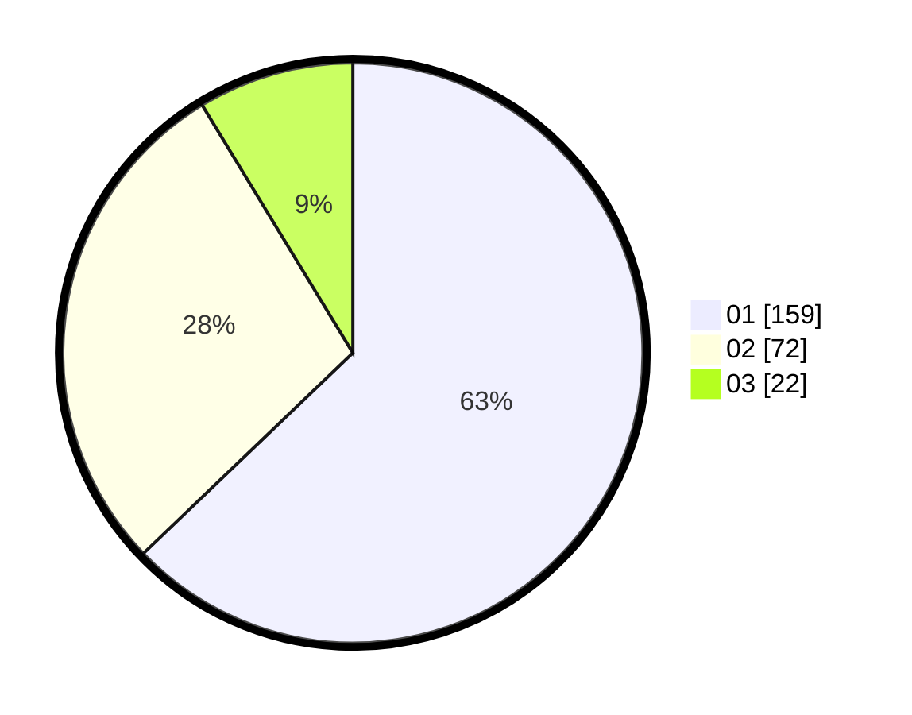

# Hasil

Hasil perolehan suara paslon dapat dilihat pada file paslon-01.txt, paslon-02.txt, dan paslon-03.txt.

Jika tidak ada, artinya data tersebut belum ada pada SIREKAP.

## Perolehan Suara

 * Paslon 01: **159**.
 * Paslon 02: **72**.
 * Paslon 03: **22**.

## Foto C Plano

https://sirekap-obj-formc.kpu.go.id/5122/pemilu/ppwp/31/73/05/10/04/3173051004075-20240214-193814--9b2da510-fbf2-453f-b9cc-35b0586eca7d.jpg

https://sirekap-obj-formc.kpu.go.id/5122/pemilu/ppwp/31/73/05/10/04/3173051004075-20240214-192630--ff67f38a-7002-4390-9d9d-3295f02250ea.jpg

https://sirekap-obj-formc.kpu.go.id/5122/pemilu/ppwp/31/73/05/10/04/3173051004075-20240214-192945--0e821241-3ab7-4f6a-9fd9-b4515afd2a11.jpg

## DATA PEMILIH TETAP

Jumlah pemilih dalam DPT: **284**.
 * L: **137**.
 * P: **147**.

## DATA PENGGUNA HAK PILIH

Jumlah pengguna hak pilih dalam DPT: **245**.
 * L: **115**.
 * P: **130**.

Jumlah pengguna hak pilih dalam DPTb: **5**.
 * L: **3**.
 * P: **2**.

Jumlah pengguna hak pilih dalam DPK: **3**.
 * L: **2**.
 * P: **1**.

Jumlah pengguna hak pilih: **253**.
 * L: **120**.
 * P: **133**.

## JUMLAH SUARA SAH DAN TIDAK SAH

JUMLAH SELURUH SUARA SAH: **253**.

JUMLAH SUARA TIDAK SAH: **0**.

JUMLAH SELURUH SUARA SAH DAN SUARA TIDAK SAH: **253**.
