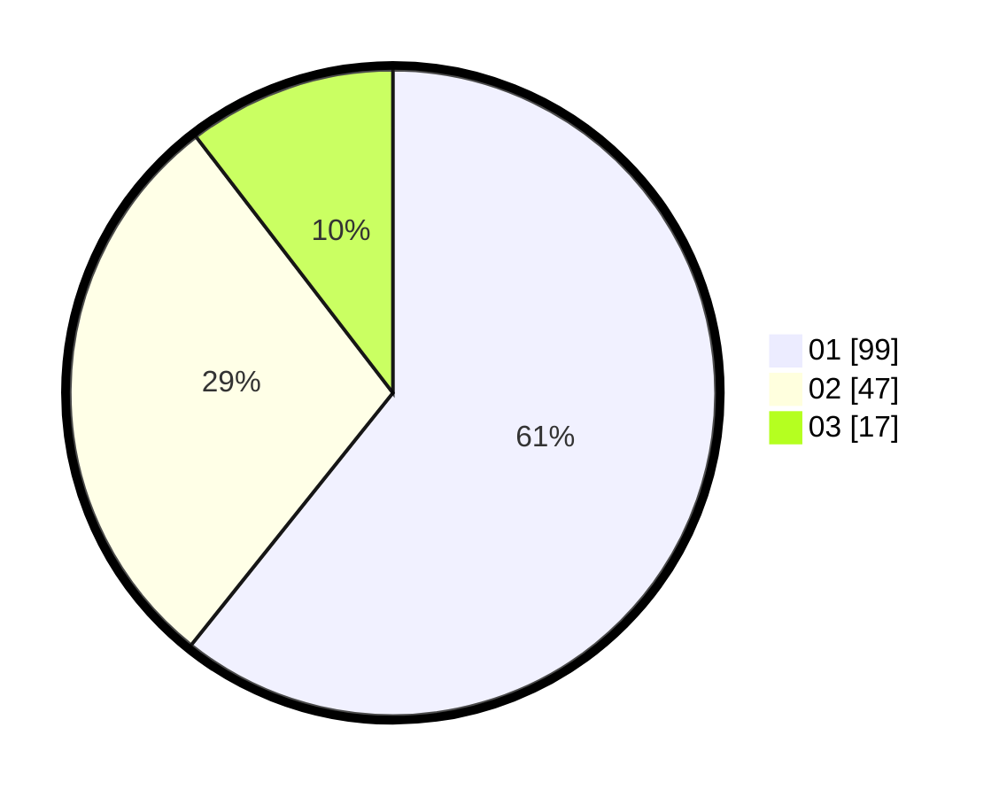

# Hasil

Hasil perolehan suara paslon dapat dilihat pada file paslon-01.txt, paslon-02.txt, dan paslon-03.txt.

Jika tidak ada, artinya data tersebut belum ada pada SIREKAP.

## Perolehan Suara

 * Paslon 01: **99**.
 * Paslon 02: **47**.
 * Paslon 03: **17**.

## Foto C Plano

https://sirekap-obj-formc.kpu.go.id/0f5c/pemilu/ppwp/31/73/05/10/04/3173051004076-20240214-202434--fef618ae-3421-43b8-9097-d2c615e9162a.jpg

https://sirekap-obj-formc.kpu.go.id/0f5c/pemilu/ppwp/31/73/05/10/04/3173051004076-20240214-202559--25783336-20bb-4ccc-9c0e-7e3456cabfdf.jpg
