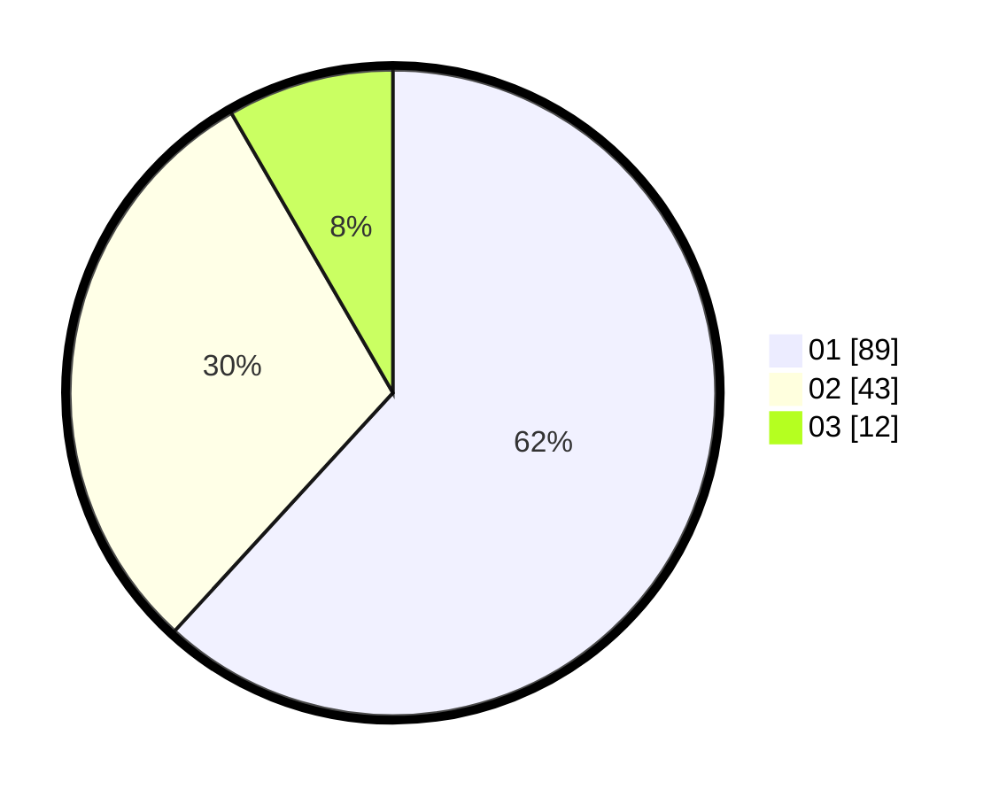

# Hasil

Hasil perolehan suara paslon dapat dilihat pada file paslon-01.txt, paslon-02.txt, dan paslon-03.txt.

Jika tidak ada, artinya data tersebut belum ada pada SIREKAP.

## Perolehan Suara

 * Paslon 01: **89**.
 * Paslon 02: **43**.
 * Paslon 03: **12**.

## Foto C Plano

https://sirekap-obj-formc.kpu.go.id/cf7c/pemilu/ppwp/31/73/05/10/04/3173051004077-20240214-192453--a36d9661-b522-4279-b6a7-23f57e3fda6a.jpg

https://sirekap-obj-formc.kpu.go.id/cf7c/pemilu/ppwp/31/73/05/10/04/3173051004077-20240214-213320--d83a96ea-1b61-486d-9db4-95fa4a003626.jpg

https://sirekap-obj-formc.kpu.go.id/cf7c/pemilu/ppwp/31/73/05/10/04/3173051004077-20240214-192541--08c3d436-8e24-4d5d-a40d-27b367e57ee3.jpg

## DATA PEMILIH TETAP

Jumlah pemilih dalam DPT: **166**.
 * L: **79**.
 * P: **87**.

## DATA PENGGUNA HAK PILIH

Jumlah pengguna hak pilih dalam DPT: **133**.
 * L: **60**.
 * P: **73**.

Jumlah pengguna hak pilih dalam DPTb: **10**.
 * L: **5**.
 * P: **5**.

Jumlah pengguna hak pilih dalam DPK: **1**.
 * L: **0**.
 * P: **1**.

Jumlah pengguna hak pilih: **144**.
 * L: **65**.
 * P: **79**.

## JUMLAH SUARA SAH DAN TIDAK SAH

JUMLAH SELURUH SUARA SAH: **144**.

JUMLAH SUARA TIDAK SAH: **0**.

JUMLAH SELURUH SUARA SAH DAN SUARA TIDAK SAH: **144**.
