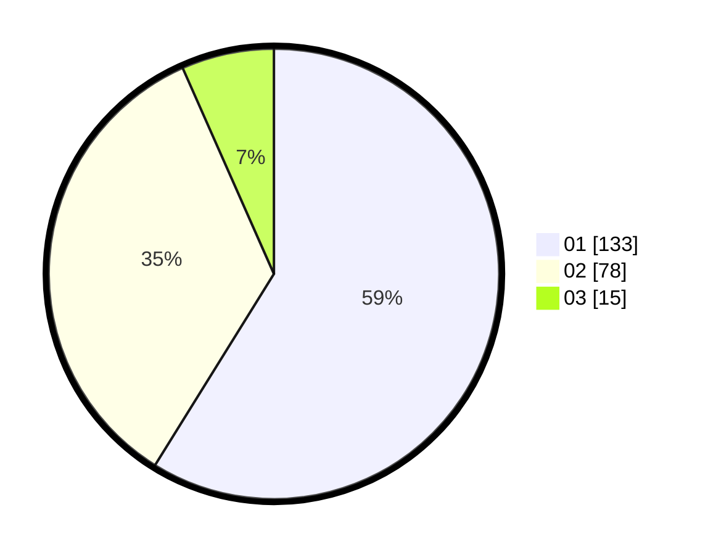

# Hasil

Hasil perolehan suara paslon dapat dilihat pada file paslon-01.txt, paslon-02.txt, dan paslon-03.txt.

Jika tidak ada, artinya data tersebut belum ada pada SIREKAP.

## Perolehan Suara

 * Paslon 01: **133**.
 * Paslon 02: **78**.
 * Paslon 03: **15**.

## Foto C Plano

https://sirekap-obj-formc.kpu.go.id/c2b9/pemilu/ppwp/31/73/05/10/04/3173051004079-20240215-003935--c6cae9d6-42dc-4a97-8f08-9b42fded7888.jpg

https://sirekap-obj-formc.kpu.go.id/c2b9/pemilu/ppwp/31/73/05/10/04/3173051004079-20240215-003943--f1556140-24af-4b93-93b7-86a3ea15f69b.jpg

https://sirekap-obj-formc.kpu.go.id/c2b9/pemilu/ppwp/31/73/05/10/04/3173051004079-20240215-003948--2dba4f7d-9065-4cee-a92a-6c41212df255.jpg
