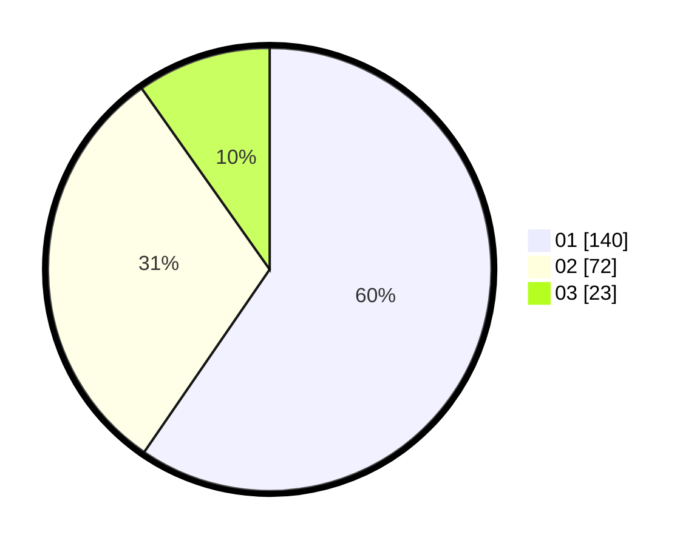

# Hasil

Hasil perolehan suara paslon dapat dilihat pada file paslon-01.txt, paslon-02.txt, dan paslon-03.txt.

Jika tidak ada, artinya data tersebut belum ada pada SIREKAP.

## Perolehan Suara

 * Paslon 01: **140**.
 * Paslon 02: **72**.
 * Paslon 03: **23**.

## Foto C Plano

https://sirekap-obj-formc.kpu.go.id/ae87/pemilu/ppwp/31/73/05/10/04/3173051004080-20240215-015501--92fe1edf-ad23-4b7a-9df1-0c08127e964c.jpg

https://sirekap-obj-formc.kpu.go.id/ae87/pemilu/ppwp/31/73/05/10/04/3173051004080-20240215-021603--3dbbb6b9-97aa-4e3b-8683-9a4374674492.jpg

https://sirekap-obj-formc.kpu.go.id/ae87/pemilu/ppwp/31/73/05/10/04/3173051004080-20240215-021810--7f34a1a1-900b-4d96-8113-2640187258c6.jpg

## DATA PEMILIH TETAP

Jumlah pemilih dalam DPT: **284**.
 * L: **144**.
 * P: **140**.

## DATA PENGGUNA HAK PILIH

Jumlah pengguna hak pilih dalam DPT: **231**.
 * L: **112**.
 * P: **119**.

Jumlah pengguna hak pilih dalam DPTb: **5**.
 * L: **3**.
 * P: **2**.

Jumlah pengguna hak pilih dalam DPK: **1**.
 * L: **0**.
 * P: **1**.

Jumlah pengguna hak pilih: **237**.
 * L: **115**.
 * P: **122**.

## JUMLAH SUARA SAH DAN TIDAK SAH

JUMLAH SELURUH SUARA SAH: **235**.

JUMLAH SUARA TIDAK SAH: **2**.

JUMLAH SELURUH SUARA SAH DAN SUARA TIDAK SAH: **237**.
