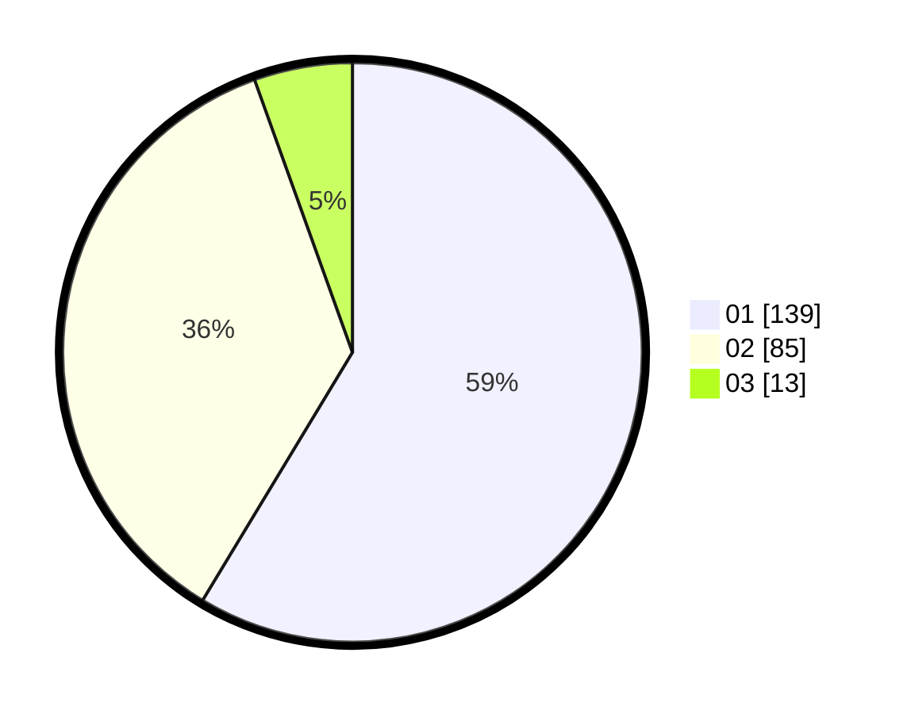

# Hasil

Hasil perolehan suara paslon dapat dilihat pada file paslon-01.txt, paslon-02.txt, dan paslon-03.txt.

Jika tidak ada, artinya data tersebut belum ada pada SIREKAP.

## Perolehan Suara

 * Paslon 01: **139**.
 * Paslon 02: **85**.
 * Paslon 03: **13**.

## Foto C Plano

https://sirekap-obj-formc.kpu.go.id/f10c/pemilu/ppwp/31/73/05/10/04/3173051004081-20240215-013613--6dd80691-5622-4d8c-89e9-f9bf4f1cbb9d.jpg

https://sirekap-obj-formc.kpu.go.id/f10c/pemilu/ppwp/31/73/05/10/04/3173051004081-20240215-014045--b1dbd218-7b9e-48d8-bf53-cd5a13ce31ce.jpg

https://sirekap-obj-formc.kpu.go.id/f10c/pemilu/ppwp/31/73/05/10/04/3173051004081-20240215-014306--842ff507-5ffb-4483-b10e-8c10543a8b3c.jpg
