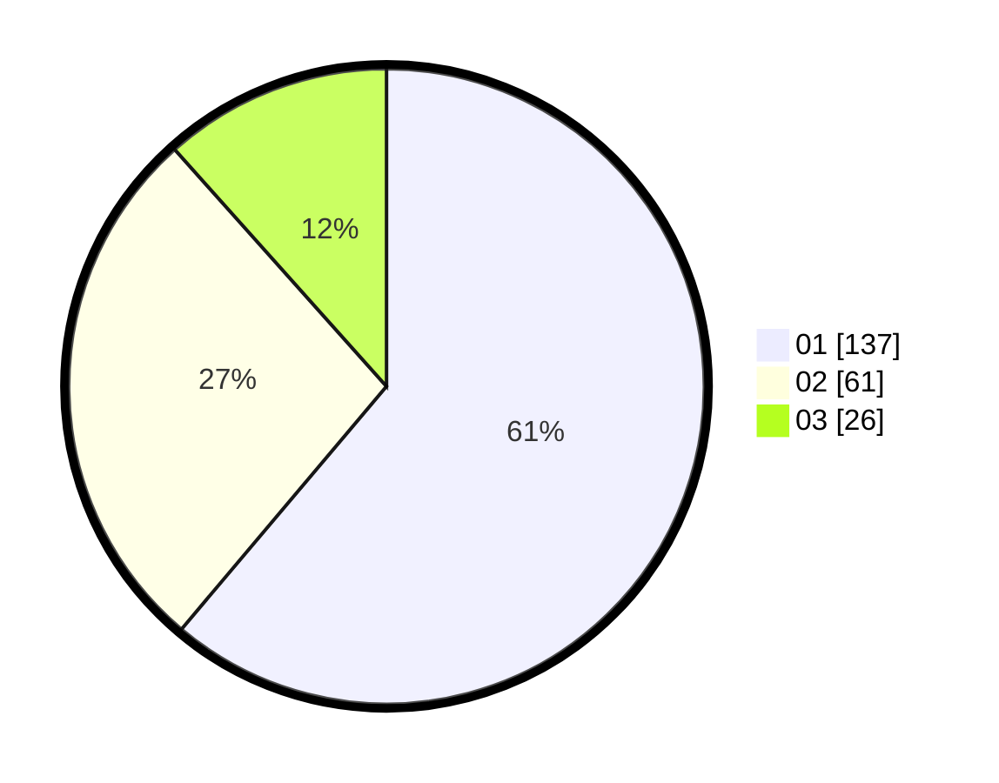

# Hasil

Hasil perolehan suara paslon dapat dilihat pada file paslon-01.txt, paslon-02.txt, dan paslon-03.txt.

Jika tidak ada, artinya data tersebut belum ada pada SIREKAP.

## Perolehan Suara

 * Paslon 01: **137**.
 * Paslon 02: **61**.
 * Paslon 03: **26**.

## Foto C Plano

https://sirekap-obj-formc.kpu.go.id/884c/pemilu/ppwp/31/73/05/10/04/3173051004082-20240214-194306--c3ee48ca-ca8d-4905-932d-93d4fbf03989.jpg

https://sirekap-obj-formc.kpu.go.id/884c/pemilu/ppwp/31/73/05/10/04/3173051004082-20240214-193925--3945fd27-3032-4e01-ac9b-0b16648186aa.jpg

https://sirekap-obj-formc.kpu.go.id/884c/pemilu/ppwp/31/73/05/10/04/3173051004082-20240214-194055--22b907ef-ab20-4130-b03b-70dfc2ae144e.jpg
