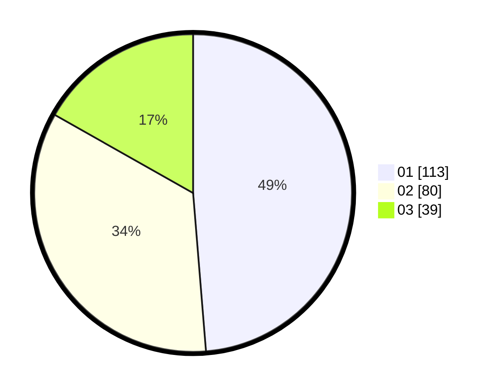

# Hasil

Hasil perolehan suara paslon dapat dilihat pada file paslon-01.txt, paslon-02.txt, dan paslon-03.txt.

Jika tidak ada, artinya data tersebut belum ada pada SIREKAP.

## Perolehan Suara

 * Paslon 01: **113**.
 * Paslon 02: **80**.
 * Paslon 03: **39**.

## Foto C Plano

https://sirekap-obj-formc.kpu.go.id/126c/pemilu/ppwp/31/73/05/10/04/3173051004083-20240214-233009--86fec70e-9f56-43c8-89a7-e84989094334.jpg

https://sirekap-obj-formc.kpu.go.id/126c/pemilu/ppwp/31/73/05/10/04/3173051004083-20240214-232557--aeac2c82-a87e-4829-b98c-e4697fe720c7.jpg

https://sirekap-obj-formc.kpu.go.id/126c/pemilu/ppwp/31/73/05/10/04/3173051004083-20240214-233149--978715ea-80cb-464b-8202-4ac5f7acd49b.jpg
