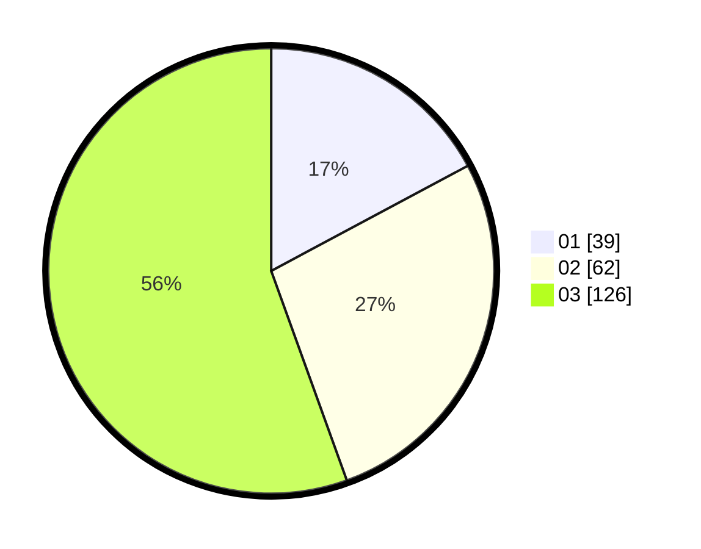

# Hasil

Hasil perolehan suara paslon dapat dilihat pada file paslon-01.txt, paslon-02.txt, dan paslon-03.txt.

Jika tidak ada, artinya data tersebut belum ada pada SIREKAP.

## Perolehan Suara

 * Paslon 01: **39**.
 * Paslon 02: **62**.
 * Paslon 03: **126**.

## Foto C Plano

https://sirekap-obj-formc.kpu.go.id/31e1/pemilu/ppwp/31/73/05/10/05/3173051005001-20240215-054712--0f756f96-db0f-43a1-a8d8-b6689770f044.jpg

https://sirekap-obj-formc.kpu.go.id/31e1/pemilu/ppwp/31/73/05/10/05/3173051005001-20240215-003808--246127b5-fe12-4e2b-a691-da3dd0c28ace.jpg

https://sirekap-obj-formc.kpu.go.id/31e1/pemilu/ppwp/31/73/05/10/05/3173051005001-20240215-055001--8527df22-c9b9-4996-b713-ea200832ec23.jpg

## DATA PEMILIH TETAP

Jumlah pemilih dalam DPT: **267**.
 * L: **121**.
 * P: **146**.

## DATA PENGGUNA HAK PILIH

Jumlah pengguna hak pilih dalam DPT: **218**.
 * L: **98**.
 * P: **120**.

Jumlah pengguna hak pilih dalam DPTb: **16**.
 * L: **7**.
 * P: **9**.

Jumlah pengguna hak pilih dalam DPK: **0**.
 * L: **0**.
 * P: **0**.

Jumlah pengguna hak pilih: **234**.
 * L: **105**.
 * P: **129**.

## JUMLAH SUARA SAH DAN TIDAK SAH

JUMLAH SELURUH SUARA SAH: **227**.

JUMLAH SUARA TIDAK SAH: **7**.

JUMLAH SELURUH SUARA SAH DAN SUARA TIDAK SAH: **234**.
