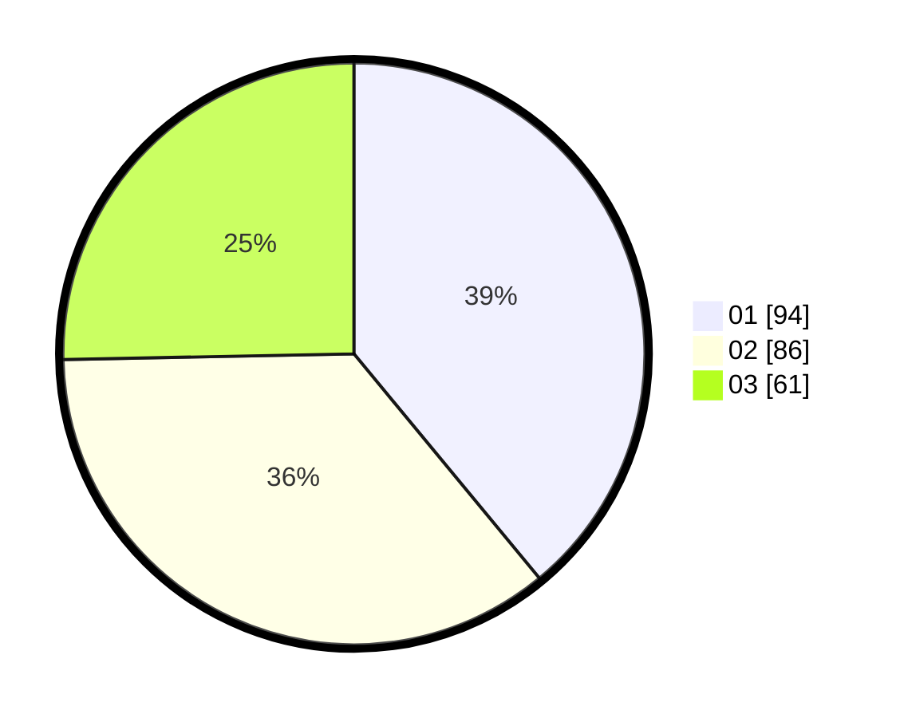

# Hasil

Hasil perolehan suara paslon dapat dilihat pada file paslon-01.txt, paslon-02.txt, dan paslon-03.txt.

Jika tidak ada, artinya data tersebut belum ada pada SIREKAP.

## Perolehan Suara

 * Paslon 01: **94**.
 * Paslon 02: **86**.
 * Paslon 03: **61**.

## Foto C Plano

https://sirekap-obj-formc.kpu.go.id/8511/pemilu/ppwp/31/73/05/10/05/3173051005002-20240214-223136--3e4af24f-5a9c-46bf-88b7-1c8d29dc7902.jpg

https://sirekap-obj-formc.kpu.go.id/8511/pemilu/ppwp/31/73/05/10/05/3173051005002-20240214-224045--be3a9472-c105-4815-8272-679e5f8be377.jpg

https://sirekap-obj-formc.kpu.go.id/8511/pemilu/ppwp/31/73/05/10/05/3173051005002-20240214-224300--17e07024-7911-470a-9c6b-9feac62bbf60.jpg
