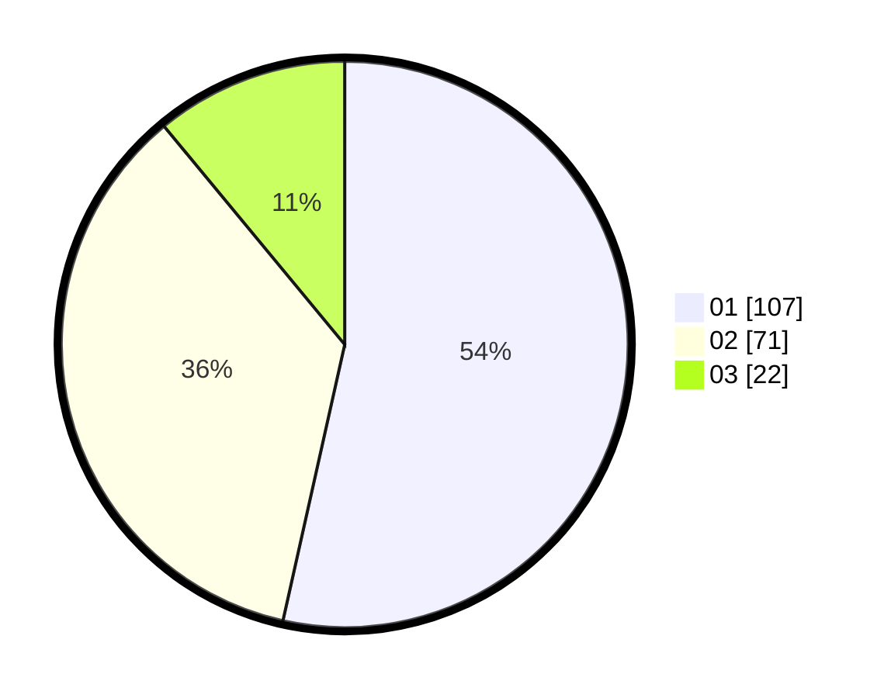

# Hasil

Hasil perolehan suara paslon dapat dilihat pada file paslon-01.txt, paslon-02.txt, dan paslon-03.txt.

Jika tidak ada, artinya data tersebut belum ada pada SIREKAP.

## Perolehan Suara

 * Paslon 01: **107**.
 * Paslon 02: **71**.
 * Paslon 03: **22**.

## Foto C Plano

https://sirekap-obj-formc.kpu.go.id/7729/pemilu/ppwp/31/73/05/10/05/3173051005007-20240214-220659--3ed1cc85-ea86-4070-ab1f-62f536077e61.jpg

https://sirekap-obj-formc.kpu.go.id/7729/pemilu/ppwp/31/73/05/10/05/3173051005007-20240214-221003--71fd7a75-3031-4819-b9e2-517151dbd2ea.jpg

https://sirekap-obj-formc.kpu.go.id/7729/pemilu/ppwp/31/73/05/10/05/3173051005007-20240214-221328--a4c827d9-6ce2-4f86-bd66-b8f322e7ea32.jpg
