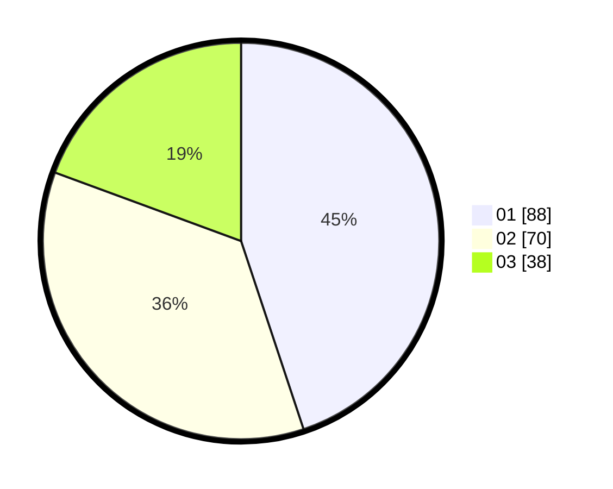

# Hasil

Hasil perolehan suara paslon dapat dilihat pada file paslon-01.txt, paslon-02.txt, dan paslon-03.txt.

Jika tidak ada, artinya data tersebut belum ada pada SIREKAP.

## Perolehan Suara

 * Paslon 01: **88**.
 * Paslon 02: **70**.
 * Paslon 03: **38**.

## Foto C Plano

https://sirekap-obj-formc.kpu.go.id/3297/pemilu/ppwp/31/73/05/10/05/3173051005008-20240214-160128--def3625c-9d15-4483-a836-3d10a48ae417.jpg

https://sirekap-obj-formc.kpu.go.id/3297/pemilu/ppwp/31/73/05/10/05/3173051005008-20240214-160135--2fa1b900-5902-4490-aefb-97fba6da42a4.jpg

https://sirekap-obj-formc.kpu.go.id/3297/pemilu/ppwp/31/73/05/10/05/3173051005008-20240214-160141--16257de3-ad7f-4e99-bc50-4af10def2273.jpg

## DATA PEMILIH TETAP

Jumlah pemilih dalam DPT: **289**.
 * L: **143**.
 * P: **140**.

## DATA PENGGUNA HAK PILIH

Jumlah pengguna hak pilih dalam DPT: **191**.
 * L: **89**.
 * P: **102**.

Jumlah pengguna hak pilih dalam DPTb: **3**.
 * L: **3**.
 * P: **0**.

Jumlah pengguna hak pilih dalam DPK: **2**.
 * L: **1**.
 * P: **1**.

Jumlah pengguna hak pilih: **196**.
 * L: **93**.
 * P: **103**.

## JUMLAH SUARA SAH DAN TIDAK SAH

JUMLAH SELURUH SUARA SAH: **196**.

JUMLAH SUARA TIDAK SAH: **0**.

JUMLAH SELURUH SUARA SAH DAN SUARA TIDAK SAH: **196**.
