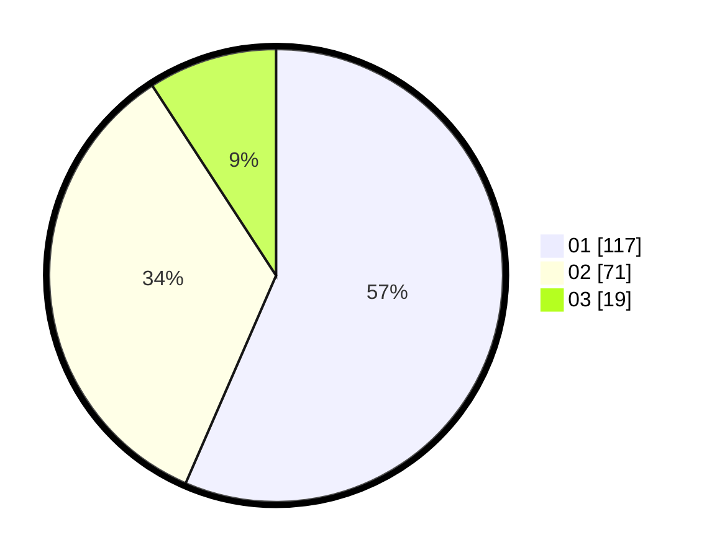

# Hasil

Hasil perolehan suara paslon dapat dilihat pada file paslon-01.txt, paslon-02.txt, dan paslon-03.txt.

Jika tidak ada, artinya data tersebut belum ada pada SIREKAP.

## Perolehan Suara

 * Paslon 01: **117**.
 * Paslon 02: **71**.
 * Paslon 03: **19**.

## Foto C Plano

https://sirekap-obj-formc.kpu.go.id/6d98/pemilu/ppwp/31/73/05/10/05/3173051005011-20240214-233056--97a2de49-dfea-4c0f-9432-513bfaccaebb.jpg

https://sirekap-obj-formc.kpu.go.id/6d98/pemilu/ppwp/31/73/05/10/05/3173051005011-20240214-233223--31220d6a-e6eb-4c55-a768-08fd486ca93f.jpg

https://sirekap-obj-formc.kpu.go.id/6d98/pemilu/ppwp/31/73/05/10/05/3173051005011-20240214-234656--7571b251-a18b-4e31-aa42-9b4f6d34d13a.jpg
